# Install and configure the Event Organizer PowerApps sample

Step-by-step instructions for installing and configuring the Event Organizer PowerApps sample.

Estimated time to complete these steps: **25-30 minutes**

If you would like to see a demonstration of this process please watch [this installation and setup video](https://youtu.be/e7zxMX9DDro).

## Event Organizer PowerApps sample overview
The Event Creation and Management PowerApp enables event managers and other users to easily organize events like a corporate conference or trade fair. Event attendees can self-register quickly and easily, and they can sign up to receive updates about conference news, special sessions, and general information. Event managers can track registrations, check-in event participants, and access real-time statistics about event attendance.

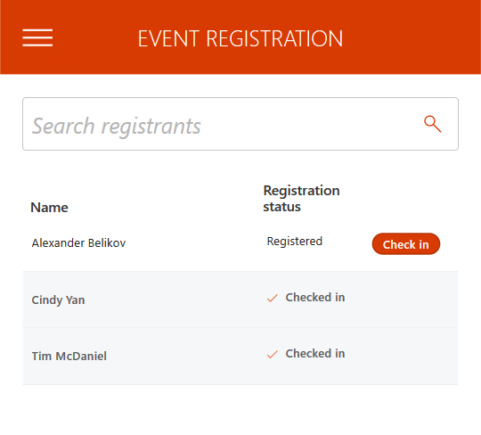

Watch the [Event Organizer Demo Video](https://youtu.be/ZEZ9ErUS6sg) to see how to use the Event Organizer PowerApp Sample.

## Prerequisites

- [Sign up](https://web.powerapps.com/) for PowerApps.
- A SharePoint Online global administrator account.
- Have a Power BI account and Power BI Desktop installed.
- Clone the project to your local machine.

## Create the Registrations SharePoint list

This list stores the registrations for events.

## Install Site Script

1. [Download](https://www.microsoft.com/en-us/download/details.aspx?id=35588) and install the SharePoint Online Management Shell. 

2. Open the SharePoint Online Management Shell command prompt.  To do so, click the **Start** button in Windows, type **SharePoint**, then click **SharePoint Online Management Shell**.

	

3. In the SharePoint Online Management Shell command prompt, change to the EventOrganizer folder under the project that is cloned in your local environment.

    

4. Modify the script commands below by replacing the $orgName variable value (replacing all the text between the quotes, including the < and > characters) in the first line of script code, and then run the following commands in the SharePoint Online Management Shell command prompt:

    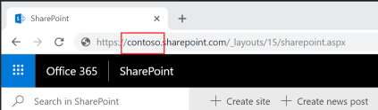

	```powershell
	$orgName="<name of your Office 365 organization, example: contoso>"
	Connect-SPOService -Url https://$orgName-admin.sharepoint.com
	```

	

5. When prompted by the Microsoft SharePoint Online Management Shell dialog box, enter the account name and password for a SharePoint global administrator account, and then click Sign in.

	

6. Run following PowerShell script to install the SharePoint Site Script. After running the cmdlet, you get a result that lists the ID of the added Site Script. Copy this ID and save it to a text file, you will need it in subsequent steps.

	```powershell
	Get-Content '.\registrationsList.json' `
	     -Raw | `
	     Add-SPOSiteScript `
	    -Title "RegistrationsList" 
	```
	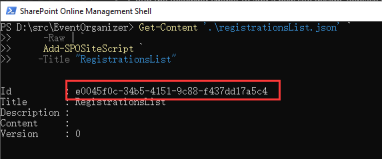

7.  Run the following cmdlet to add a new Site Design. Replace the **ID** placeholder (replace the ID text, including the < and > characters) with the Site Script ID you saved in the text file.
	
	```powershell
	Add-SPOSiteDesign `
	    -Title "Event Organizer" `
	    -WebTemplate "64" `
	    -SiteScripts "<ID>" `
	    -Description "Creates Registrations list"
	```
	
	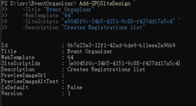

8. Open the SharePoint home page, click **Create site**, then select **Team site**.
	
	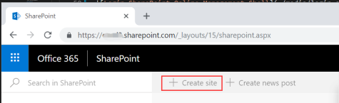
	
	

9. Select the **Event Organizer** template and use the screenshot below for reference to enter values for site name, site description and additional owners. Click **Next**.

	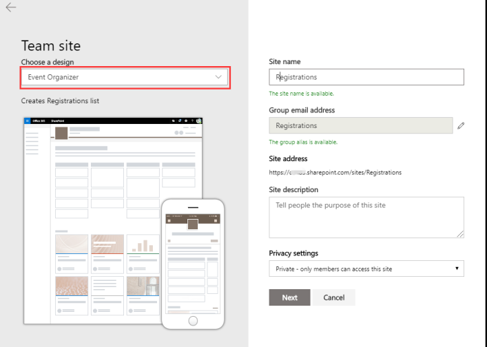

10. Add any additional owners or members, then click **Finish** button to submit.

    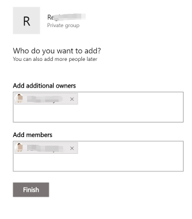

11. When the site is created, the web browser will open the new site and display the status in the right panel.

	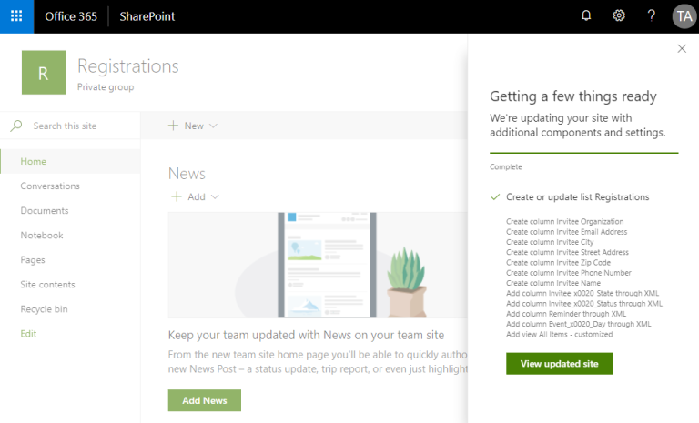

12. Close the status panel on the right, then click the **Site contents** link in the left menu. Verify the **Registrations** list exists.

	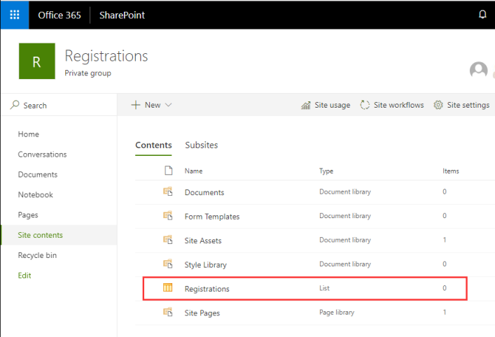	

14. **!!! IMPORTANT !!! ** Open the **Registrations** list and add at least one record for testing. 

    > **Note:** If the SharePoint list is empty, Power BI can not publish the report successfully in the next step.

## Create a Power BI workspace
1. Open a web browser and go to https://app.powerbi.com.
2. Sign in with an account that has a Power BI Pro license.
3. Click **Workspaces**.

    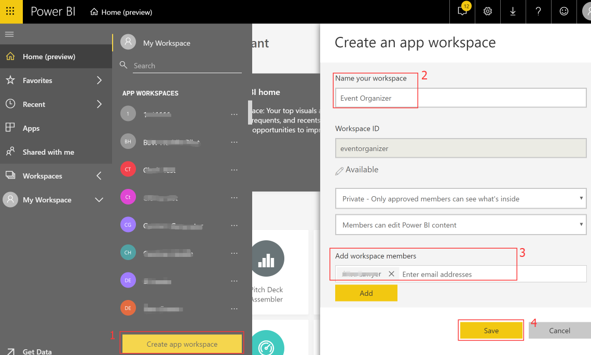

4. Click **Create app workspace**.
5. In the **Name your workspace** textbox, enter Event Organizer.
6. In the **Add workspace members** textbox enter the email addresses for all the users who will need to access the report.
7. Click **Save**.

## Create a Power BI dashboard
1.	Open the EventOrganizer.pbix report under EventOrganizer folder in your local project with Power BI desktop.
2.	Click on **Edit Queries**.  This opens the Power Query Editor.
3.	Right click on the existing **Registrations** table (shown in red box below) and select **Delete**.  Click **Delete ** again.

	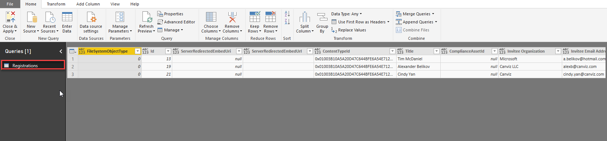

4.	Now, close the Power Query Editor.  First, click **File**.
5.	Then, click **Close & Apply**.
6.	Return to the Power BI Desktop application.
7.	Click **Get Data**.
8.	Click **More...**.
9.	Enter *SharePoint* in the search box and select **SharePoint Online List**.
 
    

10.	Click **Connect**.
11.	In the **SharePoint Site Url** textbox, enter the URL to the Registrations site.

	**For example: ** https://contoso.sharepoint.com/sites/Registrations

12.	Click **OK**.
13.	Select **Microsoft Account**.
14.	Click **Sign in**.
15.	Log in with your Office 365 administrator account.
16.	In the **Select which level to apply these settings to** radio button, select the URL to the Registrations site.
17.	Click **Connect**.
18.	Select the **Registrations** list and click **Load**.

    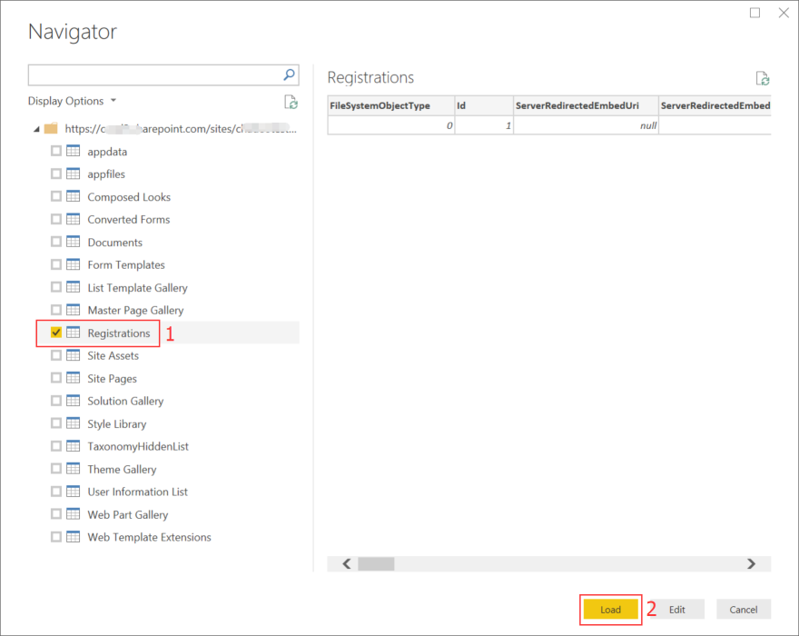

19.	Click **File**.
20.	Click **Publish** .
21.	Click **Publish to Power BI** .

    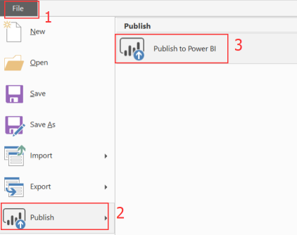

22.	In the **Select a destination** list, select the Event Organizer workspace you previously created.
23.	Click **Select**.

    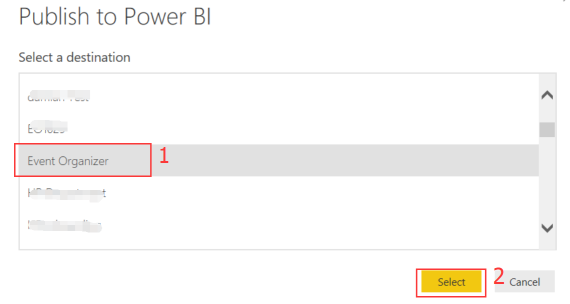

24.	Open the Power BI Workspace by going to https://app.powerbi.com
25.	Click **Workspaces**.
26.	Select the **Event Organizer** workspace. 
27.	Click **Reports**.
28.	Click the **Event Organizer** report.

    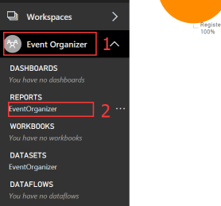

20.	Click the **Pin Visual** icon.

	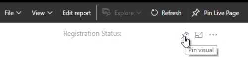	

30. Select the **New dashboard** radio button.
31. In the **Dashboard name** textbox enter Event Organizer Dashboard.
32. Click **Pin**.

    

## In PowerApps create a SharePoint connection

1.	In a web browser, navigate to https://web.powerapps.com.
2.	Sign in with the same credentials that you used to sign up for PowerApps.
3.	In the menu on the left, expand **Data**, then select **Connections**.	
4.	Click **+ New connection**.

    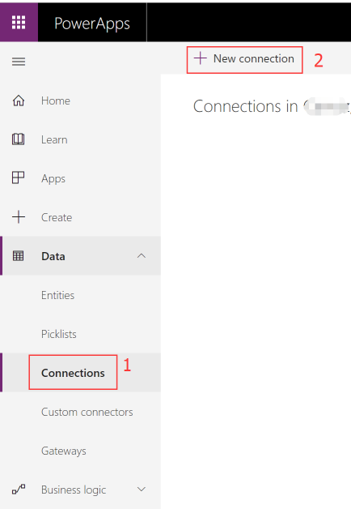

5.	In the **Search** textbox, enter **SharePoint**.
6.	Select **SharePoint** in the list.
7.	Select **Connect directly (cloud-services)**, then click **Create**.

    

8.	In the popup window, select the account you logged in with.

## Get the Event Organizer PowerApp

>**Note:** The steps in this article demonstrate how to install and configure the mobile version of the PowerApp.  The steps are exactly the same for the tablet version, except the for the PowerApp zip file you download and import.

1.	Get the mobile version EventOrganizerMobile.zip under [EventOrganizer](./) folder in your local project that is cloned in your local environment.
2.	Get the tablet version EventOrganizerTablet.zip under [EventOrganizer](./) folder in your local project that is cloned in your local environment.

## Import the Event Organizer PowerApp

1.	In a web browser, navigate to https://web.powerapps.com.
2.	Sign in by providing the same credentials that you used to sign up.
3.	In the menu on the left, select **Apps**. 
4.	Click **Import package (preview)**.
5.	Click the **Upload** button, then select the PowerApp package you downloaded in previous steps.
	
	

6.	When the import process completes, verify the **IMPORT SETUP** value is set to **Create as new**.

	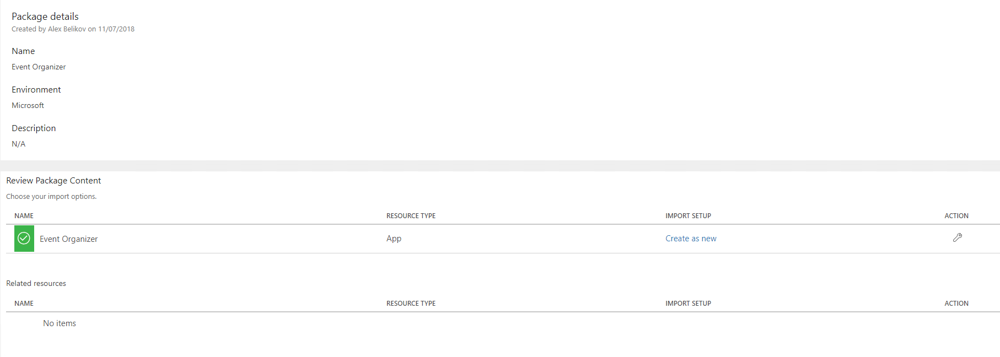

7.	Click **Import** and wait until the process is complete.

	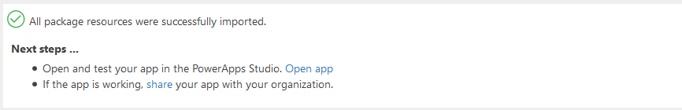

## Configure the PowerApp

1. In the web browser, click **Apps**.
2. Click the **ellipses** next to the Event Organizer PowerApp.
3. Click **Edit**.
4. Click **Allow**.

    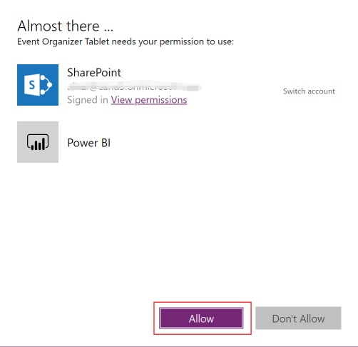

### Delete existing connection to the Registration list

1. Click **View**.
2. Click **Data sources**.
3. In the **Data** pane, click the **ellipses** next to **Registrations**.
4. Click **Remove**.

    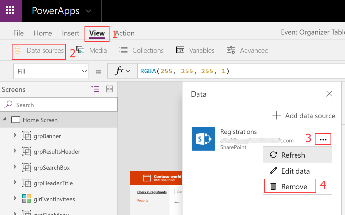

### Connect to the Registrations list

1. Click **View**.
2. Click **Data sources**.
3. In the **Data** pane, click **Add data source**.
4. Select **SharePoint**. 
5. In the **Recent sites** list, select the SharePoint site where you created the Registrations List.

	>**Note:** If the site does not appear in the list, enter the URL to the SharePoint site in the textbox, then click **Go**.

6. In the **Search** textbox at the top of the list enter **Registrations**.
7. Check the checkbox next to the **Registrations** list.
8. Click **Connect**.

    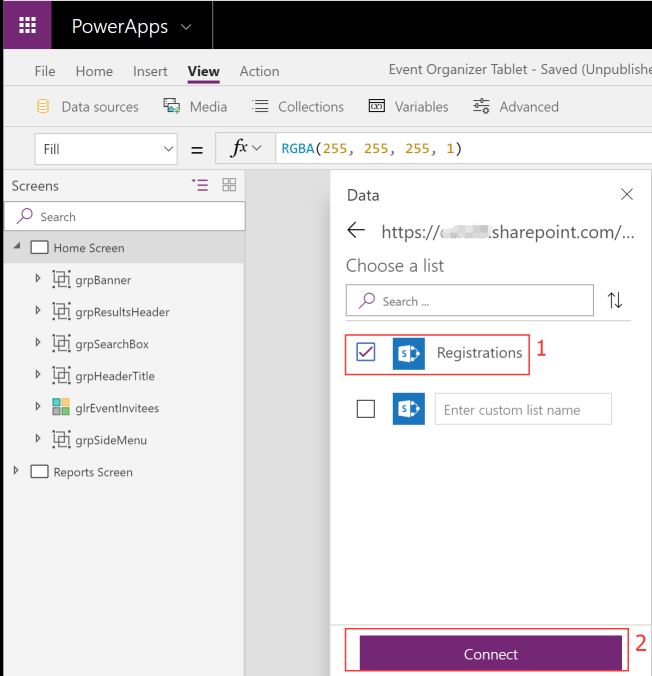

9. Click **File**.
10. Click **Save**.

### Configure the Power BI report

1. In the **Screens** pane, select the **Reports Screen**.

    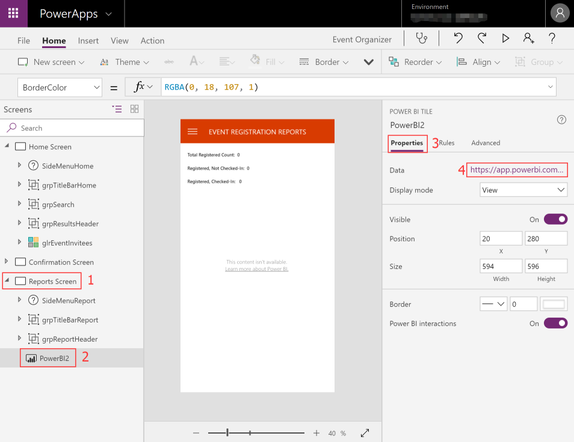

2.  Select the existing **PowerBI2** control and edit it's properties.
3.  In the **Properties pane**, click the URL that appears next to the Data label.
4.  In the **Workspace** dropdown, select **Event Organizer**.
5.  In the **Dashboard** dropdown, select **Event Organizer Dashboard**.
6.  In the **Tile** dropdown, select **Registration Status:**.
7.  Click **File**.
8.  Click **Save**.
9.  Click **Publish**.
10. Click **Publish this version**.

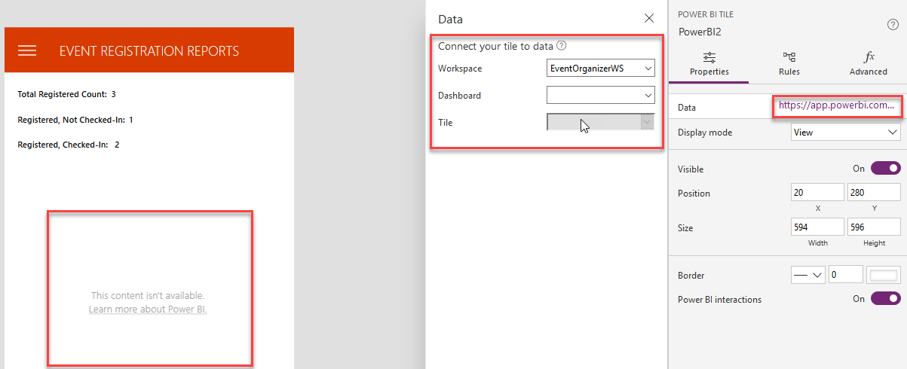

## Create MS Forms

1. In a web browser, navigate to https://forms.office.com/.
2. Sign in with your work account.
3. Click **New Forms**
4. Change the form title to **CONTOSO WORLD EXPO 2018**.

    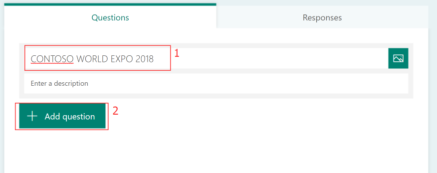

5. Click **+ Add question** and select **Text** Type
6. Update **Question** to **First Name** and toggle **Required** to on status

    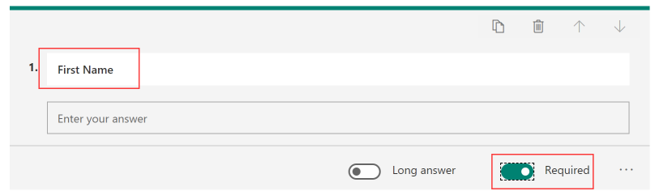

7. Add the following questions, just like you did in the previous step.
 
    | Question | Type | Required |
	| --- | --- | --- |
	| Last Name | Text | on |
	| Organization | Text | off |
	| Email Address | Text | on |
	| Street Address | Text | off |
	| City | Text | off |
	| State | Choice | off |
	| Phone Number | Text | off | 
	| Zip Code | Text | off |

8. Select the **State** question, click the **ellipsis** and check **Drop-down**. 

    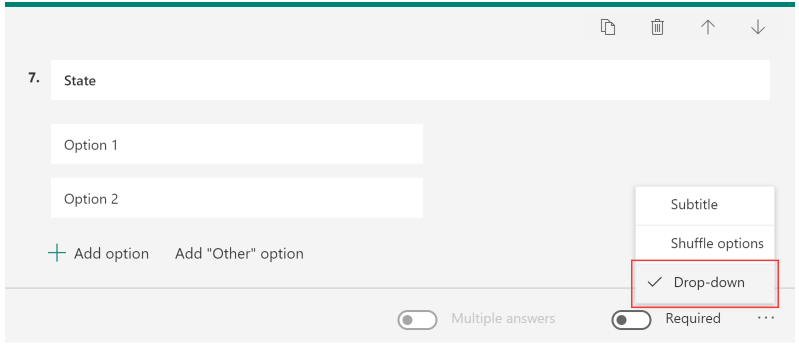

9. Add all the US states as individual **State** options.

    - Alabama
    - Alaska
    - Arizona
    - Arkansas
    - California
    - Colorado
    - Connecticut
    - Delaware
    - Florida
    - Georgia
    - Hawaii
    - Idaho
    - Illinois
    - Indiana
    - Iowa
    - Kansas
    - Kentucky
    - Louisiana
    - Maine
    - Maryland
    - Massachusetts
    - Michigan
    - Minnesota
    - Mississippi
    - Missouri
    - Montana
    - Nebraska
    - Nevada
    - NewHampshire
    - NewJersey
    - NewMexico
    - NewYork
    - NorthCarolina
    - NorthDakota
    - Ohio
    - Oklahoma
    - Oregon
    - Pennsylvania
    - RhodeIsland
    - SouthCarolina
    - SouthDakota
    - Tennessee
    - Texas
    - Utah
    - Vermont
    - Virginia
    - Washington
    - WestVirginia
    - Wisconsin
    - Wyoming

10. Exit and the forms saves automatically.

## In Flow create the Forms connection

1.	In a web browser, navigate to https://flow.microsoft.com.
2.	Sign in with the same credentials that you used to sign up for Flow.
3.	In the menu on the left, expand **Data**, then select **Connections**.	
4.	Click **+ New connection**.
5.	In the **Search** textbox, enter **Forms**, select **Microsoft Forms** in the list and click **+** to create the connection.

    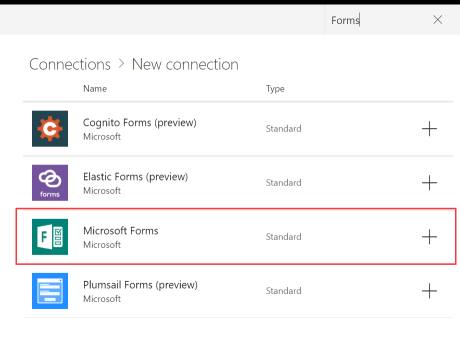

6. 	In the popup window, select the account you logged in with.

## Import the Flow

1.	In a web browser, navigate to https://flow.microsoft.com.
2.	Sign in with your work account.
3.	Click **My flows**.
4.	Click **Import**.

	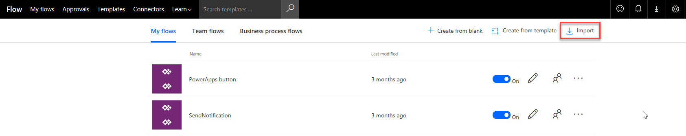

5.  Click **Upload**.
6.  Select the EventOrganizerNotificationFlow.zip file, then click **Open**.

	>**Note:** In the related resources section you may see conflicts, they are indicated with red icons.

7.  Resolve all the conflicts by clicking the **Select during import** links.

	>**Note:** Do this for all the items in the Related resources section.

	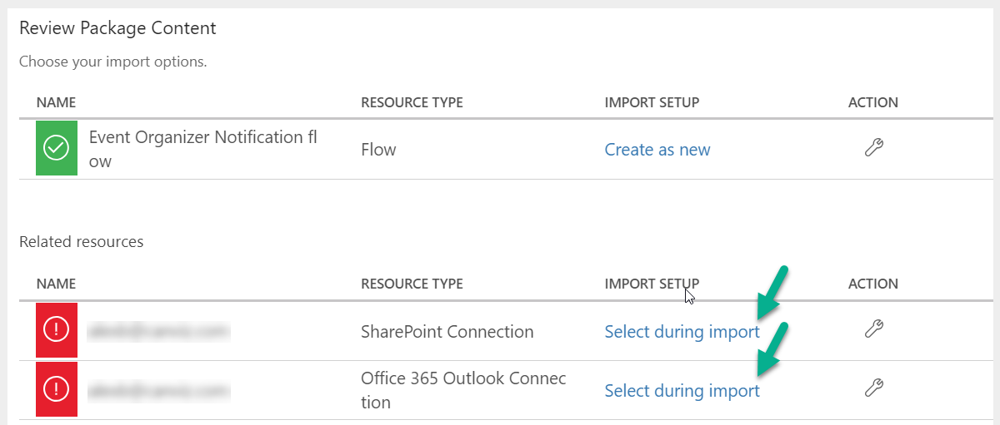

8. Select a connection from the list, then click **Save**.

	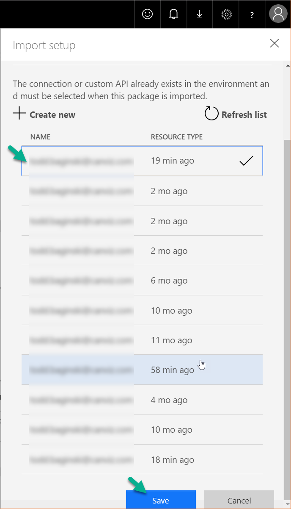
	
9.  Click **Import**.

10.  Select the SaveRegistrationToSharePointFlow.zip from your local and import it using the same process you followed in steps 7 and 8.

## Modify the Event Organizer Notification Flow

1.	In the menu on the left, click **My Flows**.
2.	If prompted to sign in, sign in by providing the same credentials that you used to sign up.
3.	Select **My flows** in the top menu.
4.	Next to the **Event Organizer Notification flow** Flow, click the **pencil icon**. 
 
	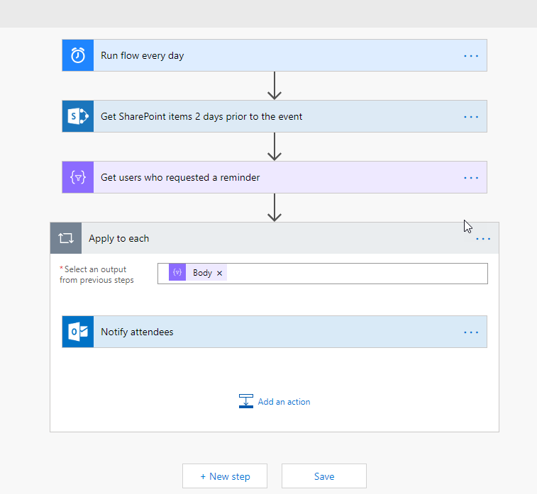

5.	Expand the **Get SharePoint items 2 days prior to the event** action. 
6.	Change the **Site Address** and **List Name** to match the Registrations SharePoint list you created.
	
	

	>**Note:** You don’t need to type it manually, you can choose it in the dropdown lists.

7.	Click **Save**.

## Modify the Save registration information to SharePoint Flow

1.	In the menu on the left, click **My Flows**.
2.	If prompted to sign in, sign in by providing the same credentials that you used to sign up.
3.	Select **My flows** in the top menu.
4.	Next to the **Save registration information to SharePoint flow** Flow, click the **pencil icon**. 
5.	Expand the **Invitee fill out registration** action and remove current Form Id value and select **CONTOSO WORLD EXPO 2018** from the dropdown list.

    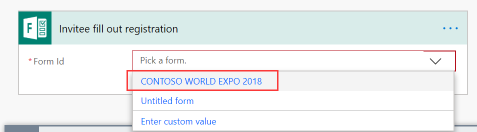
	>**Note:** You don’t need to type it manually, you can choose it in the dropdown list.

6.	Expand the **Get registration information** action in **Save to SharePoint list** action. Remove current Form Id value and select **CONTOSO WORLD EXPO 2018** from the dropdown list.
7.  Expand the **Create registration record in SharePoint** action. Change the **Site Address** and **List Name** to match the Registrations SharePoint list you created.

    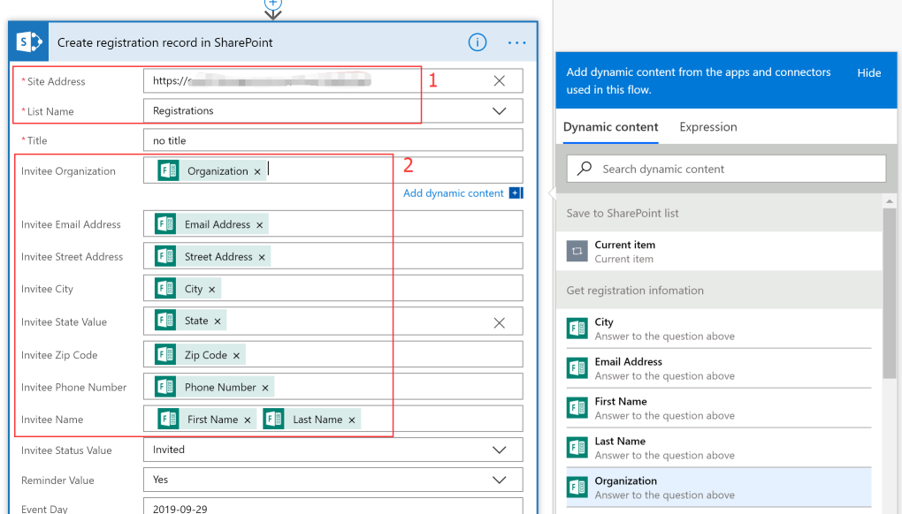

8.  Click the **Invitee Organization** input textbox, select **Organization** from the popup menu.
9.  Update the following fields with the value listed in the following table.

    | Field Name | Field Value |
	| --- | --- |
    |  Title | ⁠First Name [space] ⁠Last Name |
	|  Invitee Email Address | Email Address |
	|  Invitee Street Address | ⁠Street Address |
	|  Invitee City | ⁠City |
	|  Invitee State Value | ​State |
	|  Invitee Zip Code | ⁠Zip Code |
	|  Invitee Phone Number | ⁠Phone Number |
	|  Invitee Name | ⁠First Name [space] ⁠Last Name |
    |  Event Day | ⁠Date of the event in YYYY-MM-DD format, for example 2018-12-22 |

9.	Click **Save**.

## Play the PowerApp

1. In a web browser, navigate to https://web.powerapps.com.
2. Click **Apps**.
3. Click the **ellipses** next to the Event Organizer PowerApp.
4. Click **Play**. 
5. Click **Allow**.

Watch the [Event Organizer Demo Video](https://youtu.be/ZEZ9ErUS6sg) to see how to use the Event Organizer PowerApp Sample.

## Embed the PowerApp into a SharePoint page

>**Note:** Only Modern pages support embedding PowerApps.

There are 2 ways to embed PowerApps in a Modern SharePoint pages.
	
1.	Follow these [instructions](https://powerapps.microsoft.com/en-us/blog/embed-powerapps-on-sharepoint-pages) to embed PowerApps with the Embed web part.

2.	Follow these [instructions](https://support.office.com/en-us/article/use-the-powerapps-web-part-6285f05e-e441-408a-99d7-aa688195cd1c) to embed PowerApps with the PowerApps web part.

## Next steps

- [Customize a SharePoint list form](https://docs.microsoft.com/en-us/powerapps/maker/canvas-apps/customize-list-form)
- [Add and configure a control](https://docs.microsoft.com/en-us/powerapps/maker/canvas-apps/add-configure-controls)
- [Edit and manage permissions for a SharePoint list or library](https://support.office.com/en-us/article/edit-and-manage-permissions-for-a-sharepoint-list-or-library-02d770f3-59eb-4910-a608-5f84cc297782)
