# Install and configure the HR Onboarding PowerApps sample

Step-by-step instructions for installing and configuring the HR Onboarding PowerApps sample.

Estimated time to complete these steps: **25-35 minutes**

If you would like to see a demonstration of this process, please watch this video.

[](https://localhost )

## HR Onboarding PowerApps sample overview
The HR Onboarding App is designed to streamline and simplify the process of bringing a new employee onboard into the organization. In many organizations, onboarding new employees can be a complicated and laborious process. Multiple departments are typically involved leading to missed steps and other delays. In the past, Contoso has left many employees waiting for days to receive the equipment and training necessary for day-to-day work, such as their primary laptop computer, or training on key operating systems. In a few cases, this has meant that new employees are waiting for up-to a week to begin any actual work. 
After reviewing the current on boarding process, as well as feedback from employees and department heads, Contoso management has authorized the creation of a new business application to improve the entire on boarding experience for both new employees and the business. 

    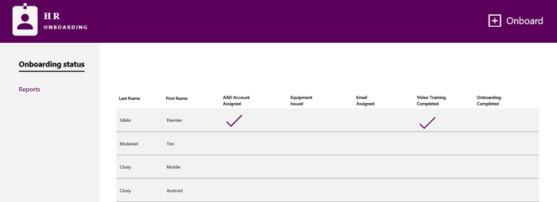

Watch this video to see how to use the HR Onboarding PowerApp Sample.

[](https://localhost)

## Prerequisites

- [Sign up](https://web.powerapps.com/) for PowerApps.
- A SharePoint Online global administrator account.
- Have a Power BI account and installed Power BI Desktop.
- Clone the project to your local

## Create the HR Onboarding SharePoint list

The HR Onboarding list stores all the onboarding new employees for this app.

### Install Site Script

1. [Download](https://www.microsoft.com/en-us/download/details.aspx?id=35588) and install the SharePoint Online Management Shell. 

2. Open the SharePoint Online Management Shell command prompt. To do so, click the **Start** button in Windows, type **SharePoint**, then click **SharePoint Online Management Shell**.

    

3. In the SharePoint Online Management Shell command prompt, change to the HROnboarding folder under the project that is cloned in your local environment.

    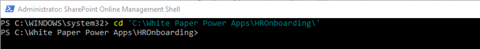

4. Modify the script commands below by replacing the $orgName variable value (replacing all the text between the quotes, including the < and > characters) in the first line of script code, and then run the following commands in the SharePoint Online Management Shell command prompt:

    

    ```powershell
    $orgName="<name of your Office 365 organization, example: contosotoycompany>"
    Connect-SPOService -Url https://$orgName-admin.sharepoint.com
    ```

    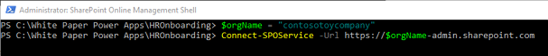

5. When prompted by the Microsoft SharePoint Online Management Shell dialog box, enter the account name and password for a SharePoint global administrator account, and then click Sign in.

    

6. Run following PowerShell script to install SharePoint Site Script. After running the cmdlet, you get a result that lists the ID of the added Site Script. Copy this ID and save it to a text file, you will need it in subsequent steps.

    ```powershell
    Get-Content '.\hronboardingList.json' `
        -Raw | `
        Add-SPOSiteScript `
        -Title "HROnboardingList" 
    ```
    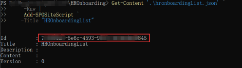

7. Run the following cmdlet to add a new Site Design. Replace <ID> with the Site Script ID you saved in the text file.

    ```powershell
    Add-SPOSiteDesign `
        -Title "HR Onboarding" `
        -WebTemplate "64" `
        -SiteScripts "<ID>" `
        -Description "Create a site with a list named HR Onboarding"
    ```

    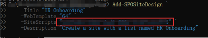

8. Open the SharePoint home page, click **Create site**, then select **Team site**.

    

    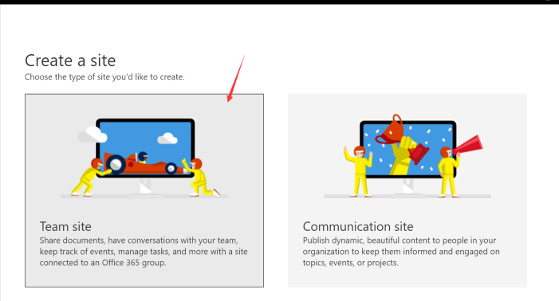

9. Select the **HR Onboarding** template and use the screenshot below for reference to enter values for site name, site description and additional owners. Click **Next**.

    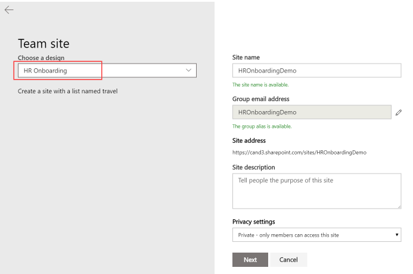

10. Add any additional owners or members, then click **Finish** button to submit.

    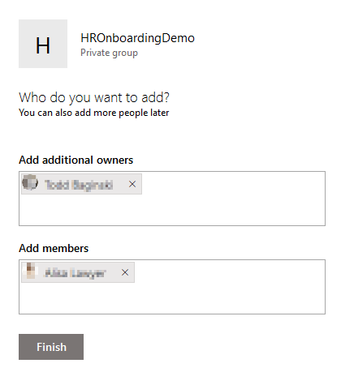

11. When the site is created, the web browser will open the new site and display the status in the right panel.

    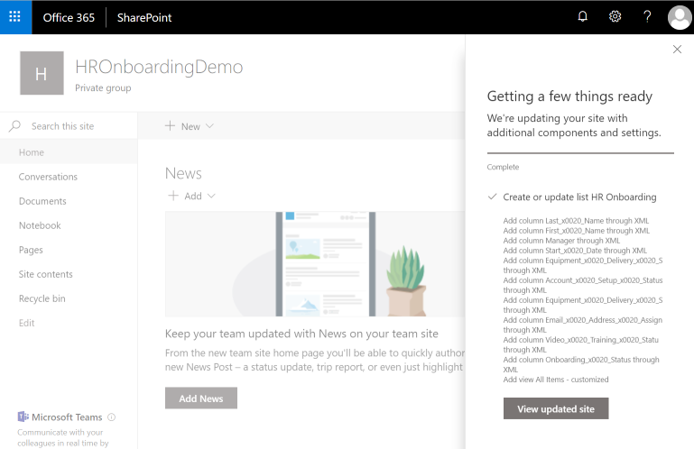

12. Close the status panel on the right, then click the **Site contents** link in the left menu. Verify the **HR Onboarding** list exists.

    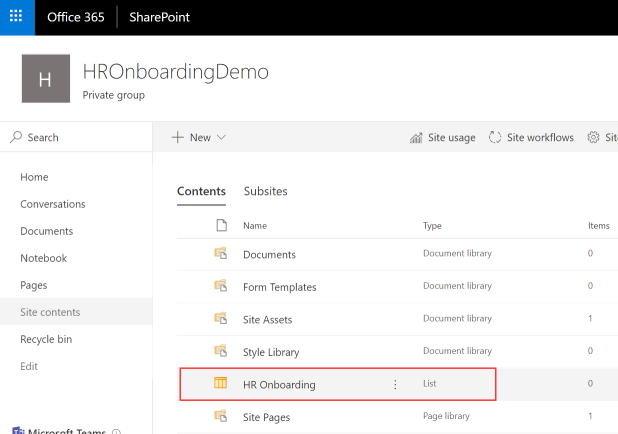

13. Open **HR Onboarding** list and add at least one record for testing. 

    > **Note:** If the SharePoint list is empty, the Power BI report will not successfully change data sources in the next step.

## Create a Power BI workspace
1. Open a web browser and go to https://app.powerbi.com.
2. Sign in with an account that has a Power BI Pro license.
3. Click **Workspaces**.

    

4. Enter the name of the SharePoint site you created in the Search area.  If the Power-BI workspace is already created you can skip to the Create a PowerBI Dashboard section.
5. Click **Create app workspace**.
6. In the **Name your workspace** textbox, enter HR Onboarding.
7. In the **Add workspace members** textbox enter the email addresses for all the users who will need to access the report.
8. Click **Save**.

## Create a Power BI dashboard
1.	Open HROnboarding-Reports.pbix report in [resource](./resource) folder with Power BI desktop.
2.	Click on **Edit Queries**.  This opens the Power Query Editor.

    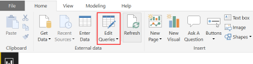

3.	Click **Data source settings**
4.  Click **Change Source...** to update to your SharePoint site created in previous. And then click **Close** to update your change

    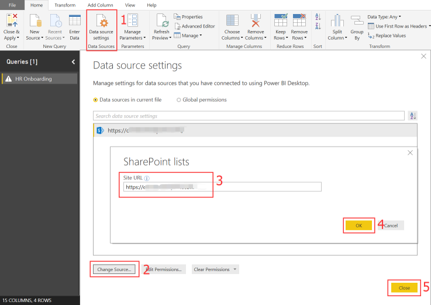

5.  Click **Refresh Preview** to refresh your changes. And you may need to **Edit Credentials** as following screenshot order.

    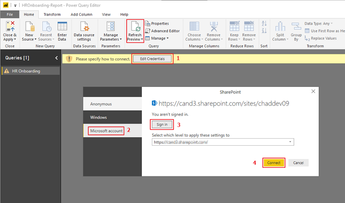

6.  Click **Close & Apply** button to apply your changes. and then click **Publish** button on a Ribbon and select the HR Onboarding workspace you created in previous steps

    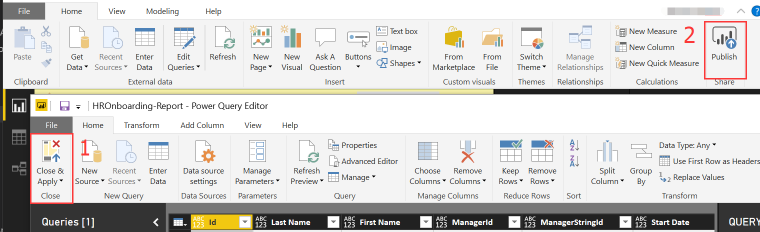

8.	Open the workspace by going to https://app.powerbi.com

    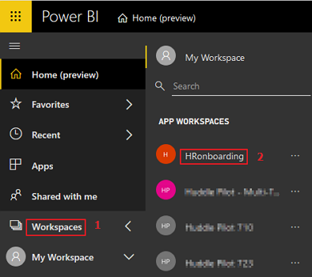

9.	Open the existing report and click on the **pin** icon next to the chart

    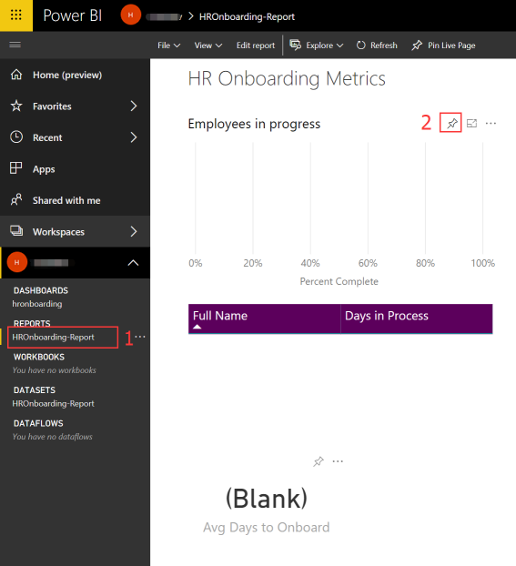

10.	Create a new dashboard

    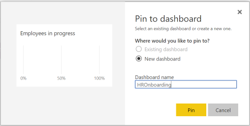

11. Repeat step 9 for the other 2 visuals and ping them to the same dashboard created in step 10

    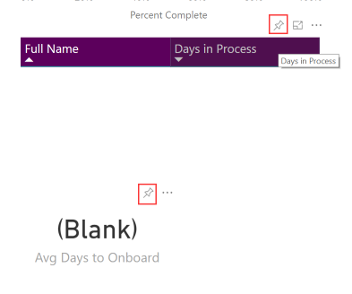

12. Click the **ellipses** next to **HR Onboarding Reports** in DATASETS, then click **SCHEDULE REFRESH**

    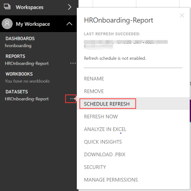

13. **Edit credentials** in Data source credentials and turn on **Keep your data update to date** in Scheduled refresh section and click **Apply** button to save changes

    

14. Click the **ellipses** next to **HR Onboarding Reports** in DATASETS, then click **REFRESH NOW**

    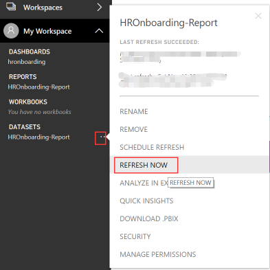

## Create Groups
1. Open a new PowerShell console as an administrator and run the following command: 

    ```powershell
        Set-ExecutionPolicy RemoteSigned
    ```
2.  Then run create-group.ps1 script, which can be found in the root directory of your local folder, in order to create 'HR Department', 'IT Equipment Department', 'IT Department', 'Corporate Training Department' groups. After the cmdlet runs, you will need to login with the SharePoint Online global administrator. Copy and save the returned values **<ExternalDirectoryObjectId>**

    ```powershell
    ./create-group.ps1
    ```

    

3. Run the following command: 
    
    ```powershell
        Set-ExecutionPolicy Default     
    ```

## In PowerApps create SharePoint connection

1.	In a web browser, navigate to https://web.powerapps.com.
2.	Sign in with the same credentials that you used to sign up for PowerApps.
3.	In the menu on the left, expand **Data**, then select **Connections**.	
4.	Click **+ New connection**.

    

5.	In the **Search** textbox, enter **SharePoint**.
6.	Select **SharePoint** in the list.
7.	Select **Connect directly(cloud-services)** and click **Create**.

    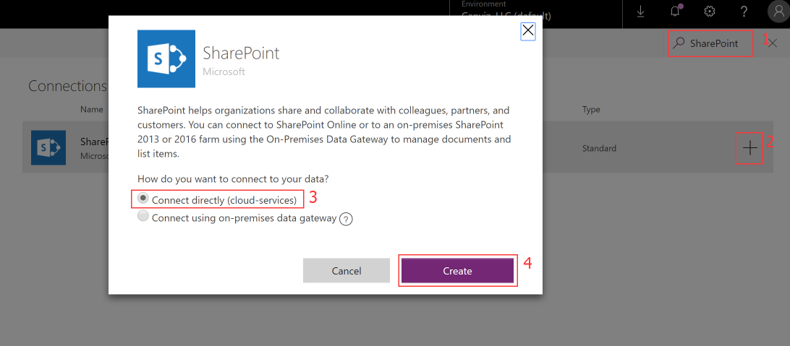

8.	In the popup window, select the account you logged in with.

## Download the HR Onboarding PowerApp

>**Note:** The steps in this article demonstrate how to install and configure the mobile version of the PowerApp.  The steps are exactly the same for the tablet version, except the for the PowerApp zip file you download and import.

1.	Get the mobile version HROnboardingMobile-PowerApp.zip under [HROnboarding/resource](./resource) folder in your local project that is cloned in your local environment.
2.	Get the tablet version HROnboardingPad-PowerApp.zip under [HROnboarding/resource](./resource) folder in your local project that is cloned in your local environment.

### Import the HR Onboarding PowerApp
1.	In a web browser, navigate to https://web.powerapps.com.
2.	Sign in by providing the same credentials that you used to sign up.
3.	In the menu on the left, select **Apps**. 
4.	Click **Import package(preview)**.
5.	Click the **Upload** button and select the PowerApp package HROnboardingPad-PowerApp.zip in [resource](./resource) folder.
	
	

6.	When the uploading process completes, verify the **IMPORT SETUP** value is set to **Create as new**.
	
	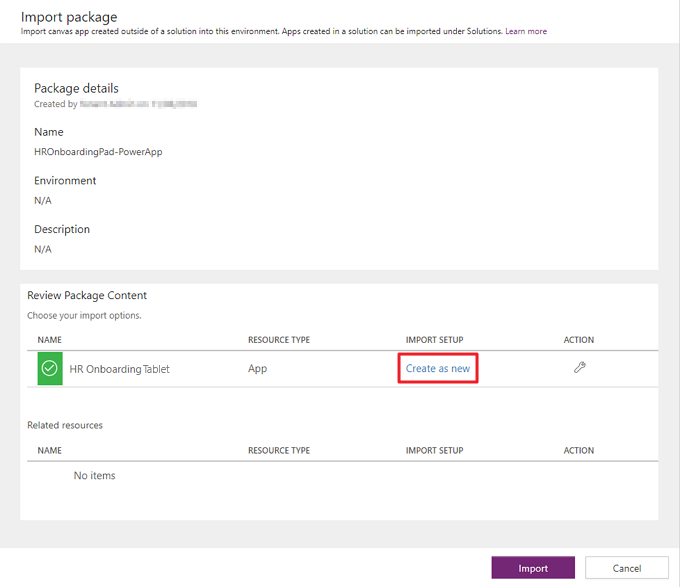

7.	Click **Import** and wait until the process is complete.

	

### Configure the PowerApp
1. In the web browser, Click **Home** to return to PowerApps home page.
2. Click **Apps**.
3. Click the **ellipses** next to the HR Onboarding PowerApp.
4. Click **Edit**.

    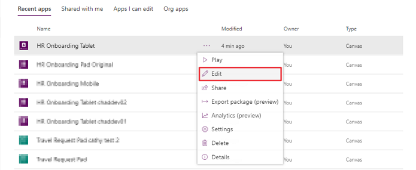

5. Click **Allow**.

#### Delete existing connection to the HR Onboarding list
1. Click **View**.
2. Click **Data sources**.
3. In the **Data** pane, click the **ellipses** next to **HR Onboarding**.
4. Click **Remove**.

    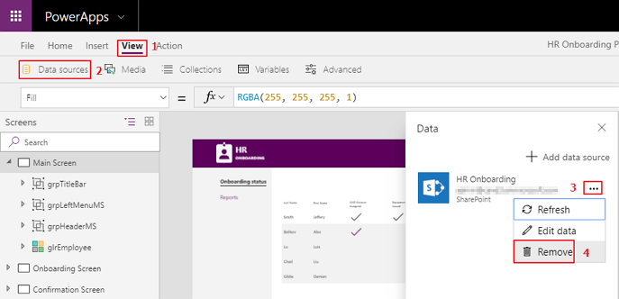

#### Connect to the HR Onboarding list
1. Click **View**.
2. Click **Data sources**.
3. In the **Data** pane, click **+ Add data source**.
4. Select a **SharePoint** connection.

    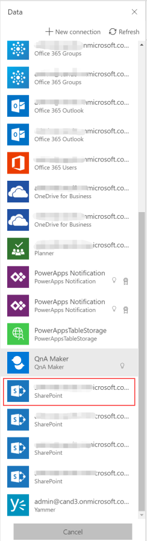

5. In the **Recent sites** list, select the SharePoint site where you created the HR Onboarding List.

	> **Note:** If the site does not appear in the list, enter the URL to the SharePoint site in the textbox and click, **Go**.

6. In the **Search** textbox at the top of the list enter **HR Onboarding**.
7. Check the checkbox next to the **HR Onboarding** list.
8. Click **Connect**.

    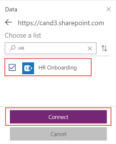

9. Click **File**.
10. Click **Save**.

#### Configure Power BI report

1.	In the **Screens** pane, select the **Reports Screen**.
2.	Select the existing pbiReportEmployeesInProgress control and edit it's **Data** property to connect to the following
3.	In the Properties pane, click the URL that appears next to the Data label.
4.	In the Workspace dropdown, select **HR Onboarding**.
5.	In the Dashboard dropdown, select **HR Onboarding**.
6.	In the Tile dropdown, select **Employees in Process**.

    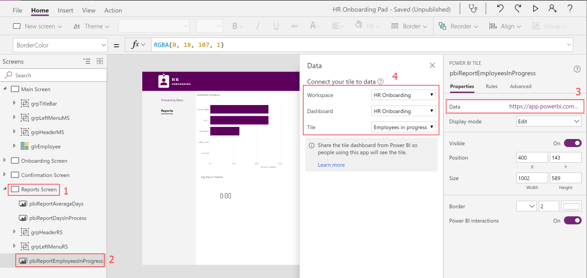

7.	Select the existing pbiReportDaysInProcess control and edit it's **Data** property to connect to **Days in Process** tile as previous step.
8.	Select the existing pbiReportAverageDays control and edit it's **Data** property to connect to **Avg Days to Onboard** tile as previous step.
9.  Click **File**.
10.  Click **Save**.
11.  Click **Publish**.
12.  Click **Publish this version**.

## Import the Flow

### Login to Microsoft Flow
1.	In a web browser, navigate to https://flow.microsoft.com
2.	Sign in with your work account

### Create connections
1.	In the menu on the left, select **Data** > **Connections**.
2.  Click **+New connection**.
3.	Add **SharePoint** connection with **Connect directly (cloud-services)** settings.

    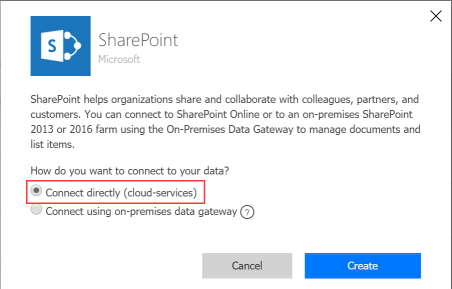

4.  Repeat steps 2 and 3 to add the **Office 365 Outlook** connection.

### Import the Flow 
1.  Click **My flows** in the menu on the left.
2.  Click **Import**, then click **Upload** and select the HROnboarding-Flow.zip file.
3.  Resolve conflicts for related resources by clicking on **Select during import**, selecting a connection, then clicking **Save**.
     
    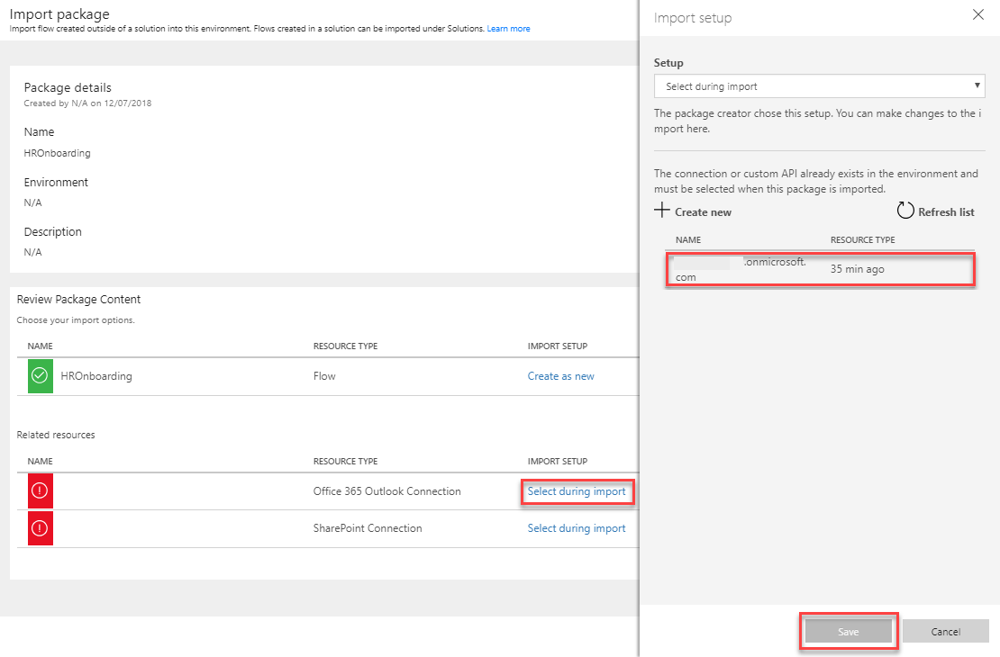

4.  Click **Import**

    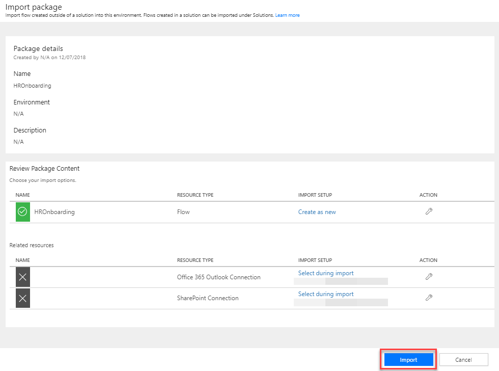

## Modify the HR Onboarding Flow
1.	In the menu on the left, click **My flows**.
2.	If prompted to sign in, sign in by providing the same credentials that you used to sign up.
3.	Next to the **HROnboarding** Flow, click the **pencil icon**. 
4.	Expand the **New Employee Form Created** action. 
5.	Change the **Site Address** and **List Name** to match the HR Onboarding SharePoint list you created.
	
	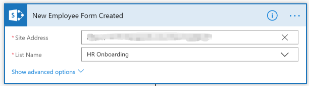

	> **Note:** You don’t need to type it manually, you can choose it in the dropdown lists.

6. In the following 5 flow sections change the **Site Address** and **List Name** to match the HR Onboarding SharePoint list you created as step 5.

    * **Update account status to completed**
    * **Update equipment delivery status to completed**
    * **Update mailbox status to completed**
    * **Update video training status to completed**
    * **New employee form completed**

    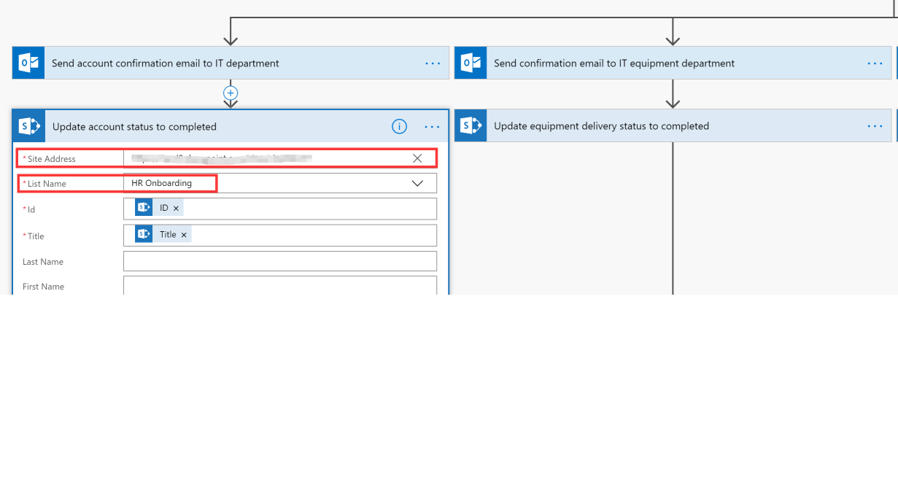

7. Change the email address for the Office 365 Groups into the email actions.

    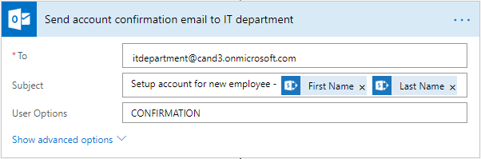

    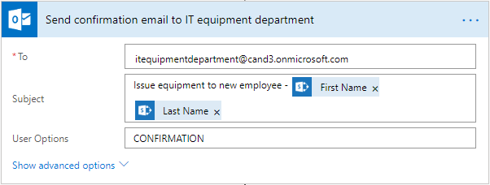

    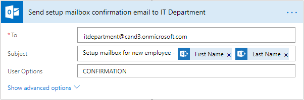

    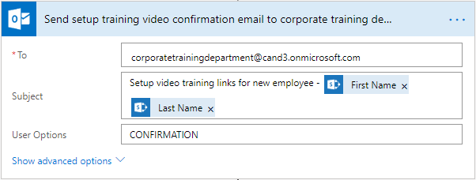

13.	Click **Save**.

    > **Note:** Make sure IT Department Group, IT Equipment Department Group and Corporate Training Department Group have members that are configured in AAD. Otherwise the Flow will fail.

## Play the PowerApp

1. In a web browser, navigate to https://web.powerapps.com.
2. Click **Apps**.
3. Click the **ellipses** next to the Event Organizer PowerApp.
4. Click **Play**. 
5. Click **Allow**.

    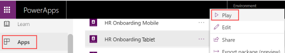

Watch this video to see how to use the HR Onboarding PowerApp Sample.

    [](https://youtu.be/sl5fXwwnvzI)


## Embed the PowerApp into a SharePoint page

>**Note:** Only Modern pages support embedding PowerApps.

There are 2 ways to embed PowerApps in a Modern SharePoint pages.
	
1.	Follow these [instructions](https://powerapps.microsoft.com/en-us/blog/embed-powerapps-on-sharepoint-pages) to embed PowerApps with the Embed web part.

2.	Follow these [instructions](https://support.office.com/en-us/article/use-the-powerapps-web-part-6285f05e-e441-408a-99d7-aa688195cd1c) to embed PowerApps with the PowerApps web part.


## Next steps
- [Customize a SharePoint list form](https://docs.microsoft.com/en-us/powerapps/maker/canvas-apps/customize-list-form)
- [Add and configure a control](https://docs.microsoft.com/en-us/powerapps/maker/canvas-apps/add-configure-controls)
- [Edit and manage permissions for a SharePoint list or library](https://support.office.com/en-us/article/edit-and-manage-permissions-for-a-sharepoint-list-or-library-02d770f3-59eb-4910-a608-5f84cc297782)
 
