# Site Visit Tracker App Installation

* [Prerequisites](#prerequisites)
* [Create All Lists and Data](#create-all-lists-and-data)
* [Import and Configure the Reminder Flow](#import-and-configure-the-flows)
  + [Login to Microsoft Flow](#login-to-microsoft-flow)
  + [Import the Reminder Flow Template](#import-the-reminder-flow-template)
  + [Modify the Reminder Flow](#modify-the-reminder-flow)
* [Install PowerBI Report](#install-powerbi-report)
  + [Create a Power BI workspace](#create-a-power-bi-workspace)
  + [Update datasource and publish report](#update-datasource-and-publish-report)
  + [Create a Power BI dashboard](#create-a-power-bi-dashboard)
  + [Schedule the reports](#schedule-the-reports)
* [Install the Site Visit Tracker PowerApp](#install-the-site-visit-tracker-powerapp)
  + [Import the PowerApp](#import-the-powerapp)
  + [Modify the Upload Photo Flow](#modify-the-upload-photo-flow)
  + [Configure the PowerApp](#configure-the-powerapp)
    - [Configure the Photo Library Path](#configure-the-photo-library-path)
    - [Delete the existing connection to the VisitLog and VisitPhotos list](#delete-the-existing-connection-to-the-visitlog-and-visitphotos-list)
    - [Connect to the VisitLog and VisitPhotos lists](#connect-to-the-visitlog-and-visitphotos-lists)
    - [Configure the Power BI report](#configure-the-power-bi-report)
    - [Save and publish the PowerApp](#save-and-publish-the-powerapp)

---
## Prerequisites

1. Install **PnP PowerShell modules** 

* **To install PnP PowerShell modules, open PowerShell as an administrator and run the following command:**  
   
  ``Install-Module SharePointPnPPowerShellOnline -AllowClobber``

2. Create a **SharePoint Team Site** where the Lists and Document Library will be created and where you will deploy this sample.

---
## Create All Lists and Data
1. Open PowerShell as an administrator and go to the folder where the script is located. Then run the following command:

   ``.\SiteVisitTracker.ps1``

    **Notes**: 
    * Please make sure all files are downloaded. 

    * Before the script will run, the following "**Security Warning**" may appear, type R to allow the script to run:

      

2. Please refer to the below table to enter the parameters:

    | **Name**                      | **Value**                   | **Description**                                              |
    | ----------------------------- | --------------------------- | ------------------------------------------------------------ |
    | **orgName**                   | \<orgName\>                       | The name of the tenant.  For example: If your SharePoint URL is http://contoso.sharepoint.com then your orgName is contoso.                                          |
    | **adminUPN**                  | \<user\>@\<orgName\>.onmicrosoft.com | The site administrator account.                |
    | **siteUrl**                   | \<Site URL\>           | The url of the SharePoint site where the Lists and Document Library will be created and where you will deploy this sample.  |

    * After entering all of the parameters, you will be asked for the user password in a pop up window.
    
      

3. After the script has successfully run you will see the following screen.

     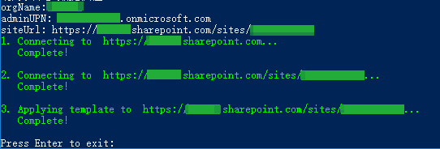 

4. Open the site to make sure the Lists and Document Library shown below were successfully created.

     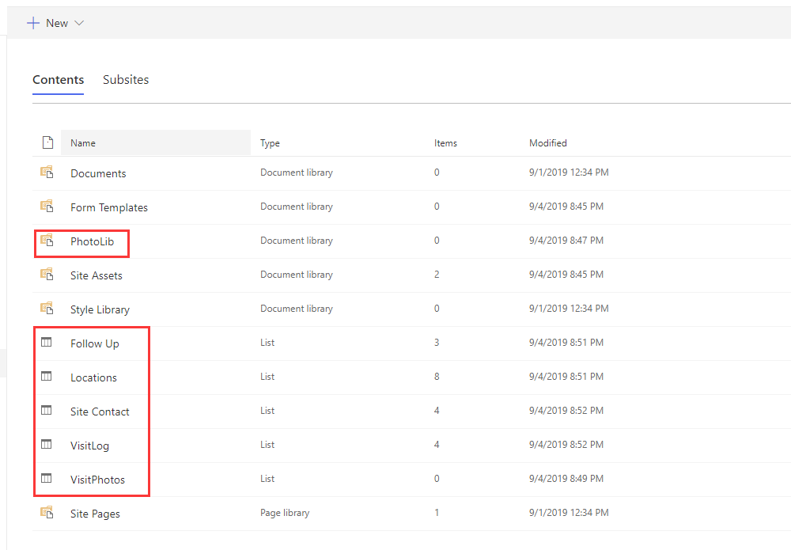 

---
## Import and Configure the Reminder Flow
In this section you will import the Flow **Site Visit Tracker in 24 hours Reminder** that monitors the **VisitLog** list and sends reminders.

### Login to Microsoft Flow
1.	In a web browser, navigate to https://flow.microsoft.com.

2.	Sign in with your work account

### Import the Reminder Flow Template
1. Click **My flows**.
2. Click **Import** and **Upload** the file **SiteVisitTrackerin24hoursReminder.zip**.

   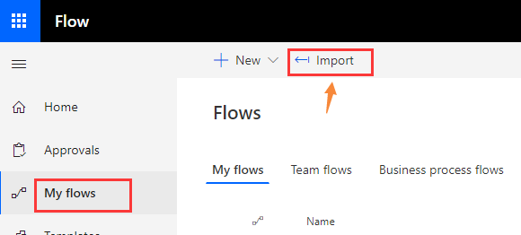
   
3. Next to the SharePoint Connection, click **select during import**.

   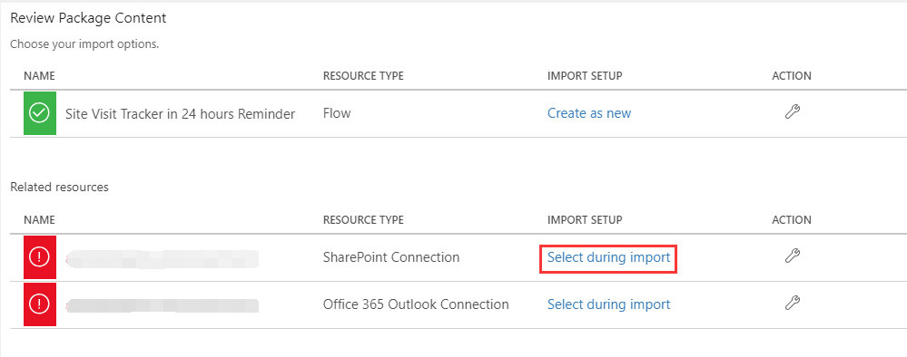

4. In the **Import setup** panel, select an existing connection. 

   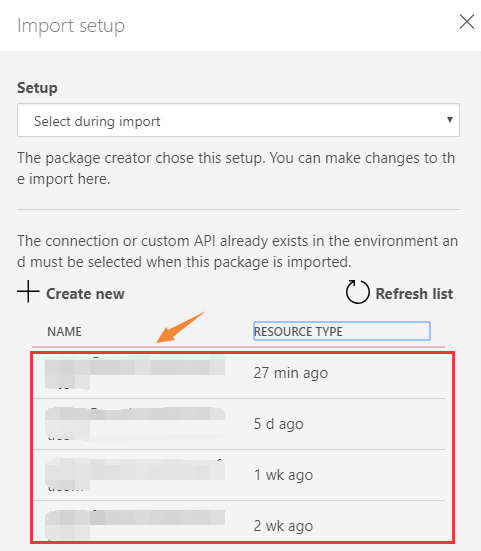

5. If there are no existing connections, click the **Create new** button to create a new SharePoint connection.

   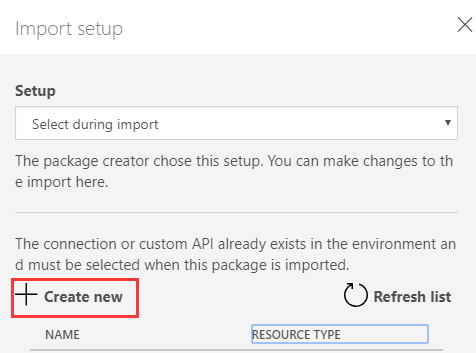

6. Then, click **New connection**.

   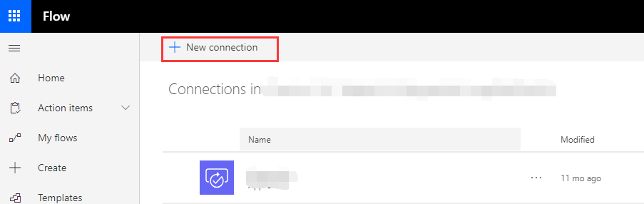

7. In the new page, please select **SharePoint**.

   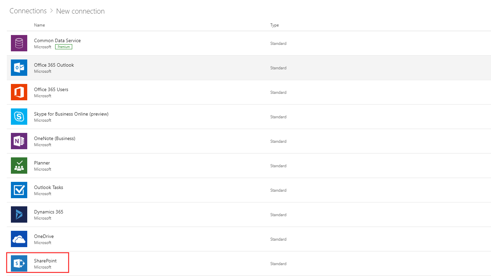

8. In the popup window, click **Create**. Pick an existing account or use another account.

   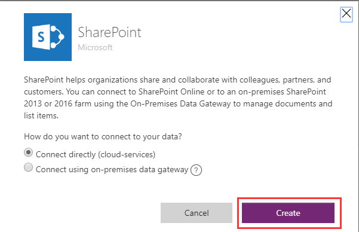

   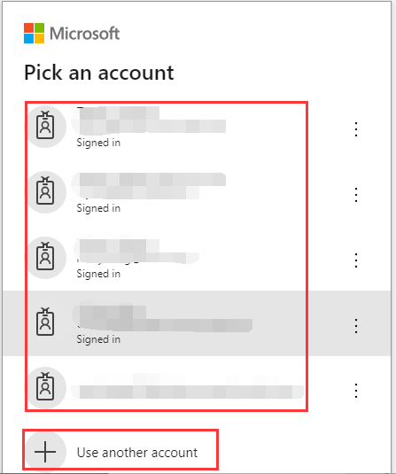

9. Return to the browser tab where you are importing the Flows. In the Import setup panel, click **Refresh list**.
10. Select the connection you just created that appears in the list.
11. Click **Save**.
12. Next to the Office 365 Outlook Connection, click **select during import**.

   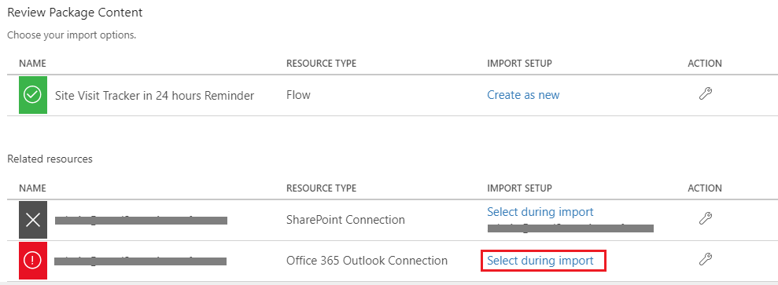

13. In the **Import setup**, select an existing connection. 

   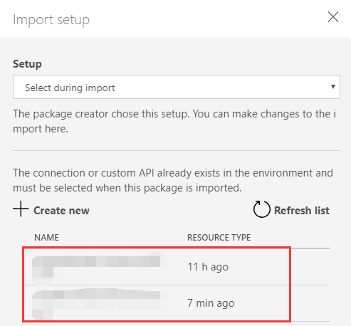

14. If there are no existing connections, click the **Create new** button to create a new Office 365 Outlook connection.

   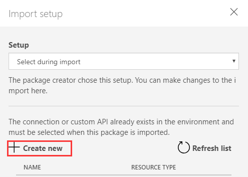

15. Click **New connection**.

   

16. In the new page, please select **Office 365 Outlook**.

   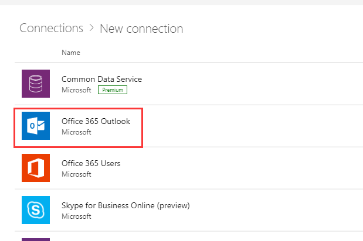

17. In the popup window, click **Create**. Pick an existing account or use another account.

   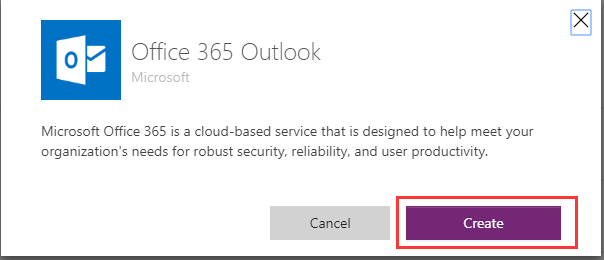

   

18. Return to the browser tab where you are importing the Flows. In the Import setup panel, click **Refresh list**.
19. Select the connection you just created that appears in the list.
20. Click **Save**.
21. For the Flow **IMPORT SETUP** setting, select **Create as new**. 

   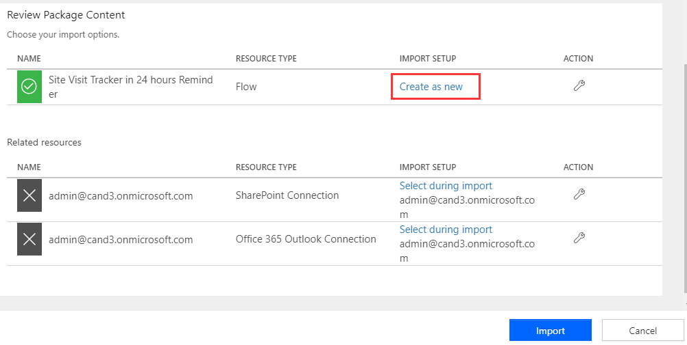

22. Click the **Import** button.

   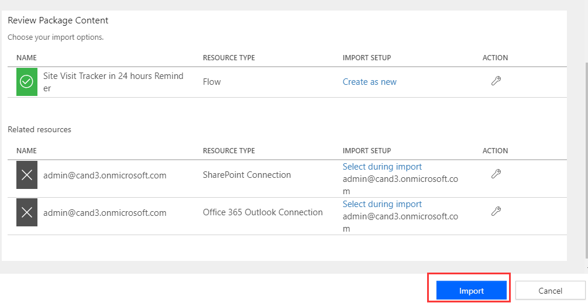

After the package is successfully imported the Review Package Content section will look like this.

   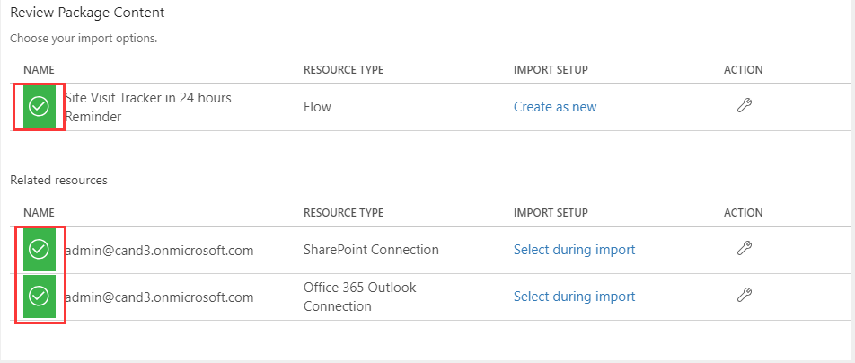

### Modify the Reminder Flow

1.	In the menu on the left, click **My Flows**.
2.	If prompted, sign in by providing the same credentials that you used to sign in before.
3.	Next to the **Site Visit Tracker in 24 hours Reminder**, click the **pencil icon**. 
4.	Expand the **Get items** action. 
5.	Change the **Site Address** to the site where all lists are installed and select the VisitLog list in the **List Name** dropdown.

    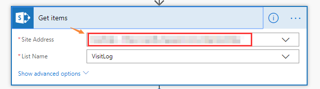

6.  Expand the **Update item** action. 
7.  Change the **Site Address** to the site where all lists are installed and select the VisitLog list in the **List Name** dropdown.

    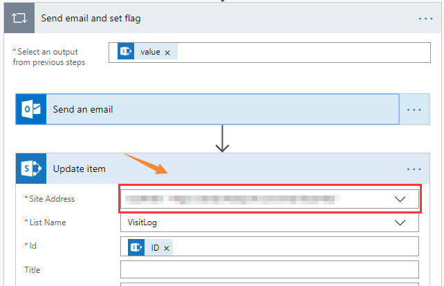

8.	Click **Save**.

---
## Install PowerBI Report

### Create a Power BI workspace
1. Open a web browser and go to https://app.powerbi.com.
2. Sign in with an account that has a Power BI Pro license.
3. Click **Workspaces**.

    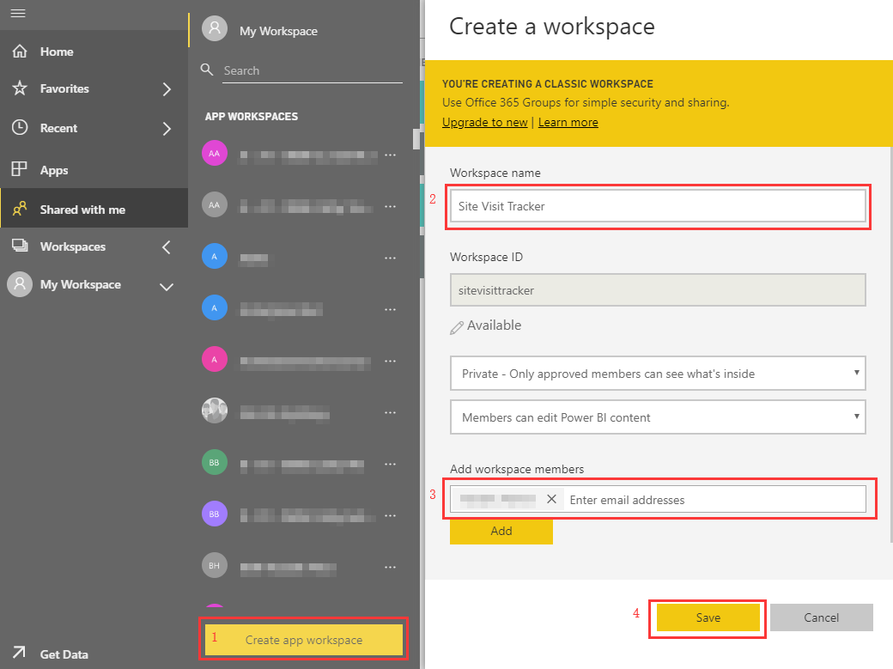
    >PowerBI released a new **Create a workspace** UI, which can be changed back by clicking link **Revert to classic** on the new UI.

4. Click **Create a workspace**.
5. In the **Workspace name** textbox, enter "Site Visit Tracker".
6. In the **Add workspace members** textbox enter the email addresses for all the users who will need to access the report.
7. Click **Save**.

### Update datasource and publish report
1. Install **Power BI Desktop** by following this [article](https://docs.microsoft.com/en-us/power-bi/desktop-get-the-desktop) 
2. Launch **Power BI Desktop** and open the file "**SiteVisit.pbix**"
3. Click **Edit Queries**.

    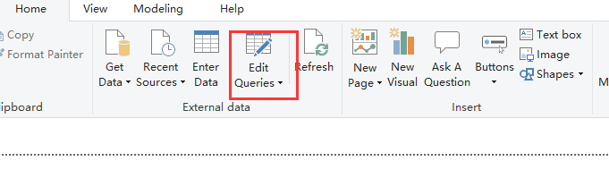

4.	Click **Data source settings**.

    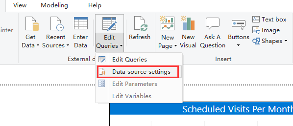

5.  Click **Change Source..** to update to the data source to use the SharePoint site you created in previous steps.

    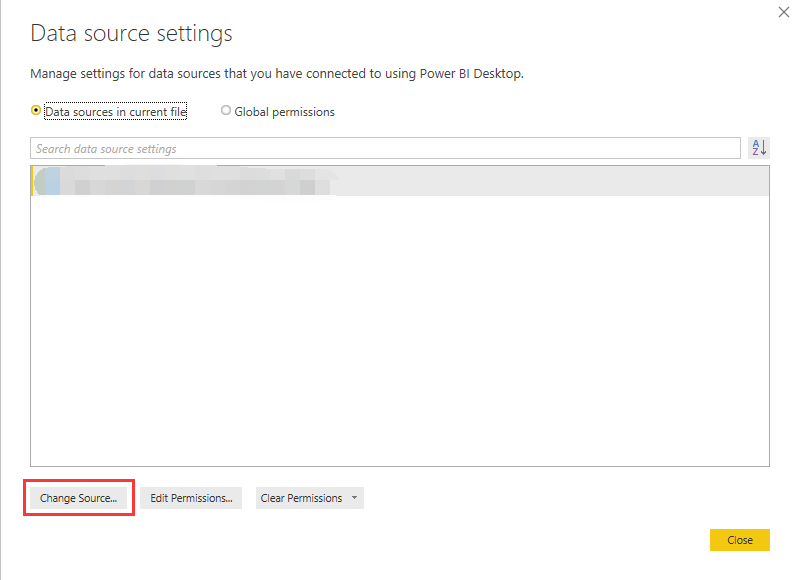

6.	Enter the SharePoint Site URL where the datasource is located and click **OK**.

    Example: "https://contoso.sharepoint.com/sites/sitevisittracker"

    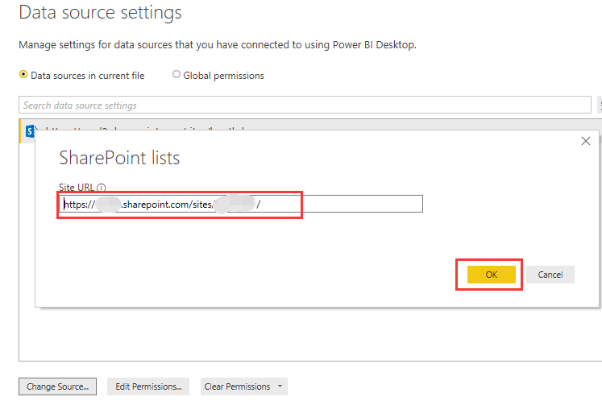

7.  Click **Close**.

    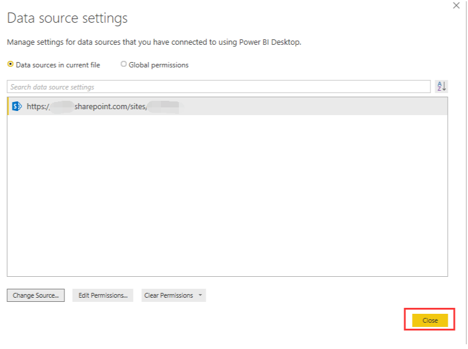

8. Click **Apply changes**.

9. Switch to **Microsoft account**, **Sign in** with your account and then click **Connect** button.

    > If your account cannot login, Power BI would pop up this window. Othwerwise, skip this step.

    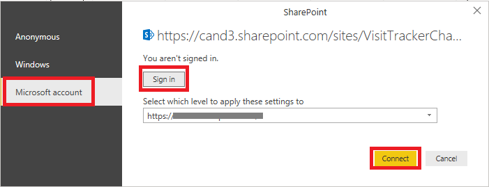

10. Click the **Publish** button in the Ribbon.

    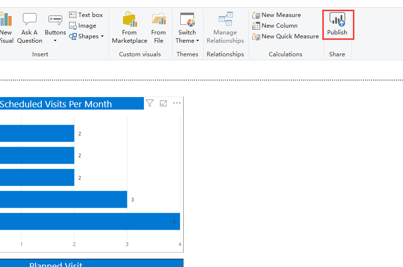

11. Click **Save**.

12. Click the workspace "Site Visit Tracker" that you previously created, then click **Select**.

    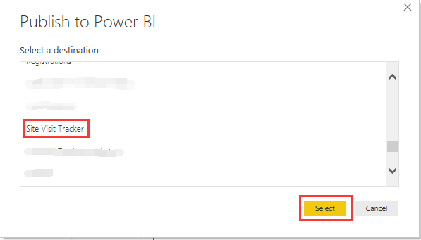

13. If the dataset already exists, you will be asked to replace the old dataset. Please click **Replace**.

    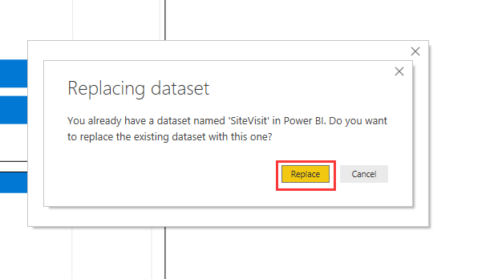

14. After publishing the report sucessfully, you will see the below screen.

    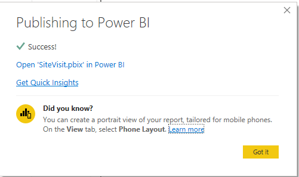

### Create a Power BI dashboard
1.	Open the workspace by opening https://app.powerbi.com in a web browser.
2.  Click **Workspaces** and find the **Site Visit Tracker** workspace you created, then click it.

    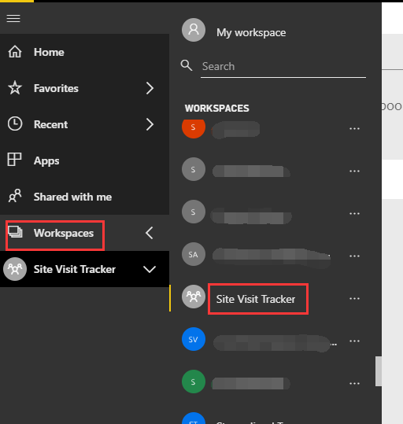

3.  Click the **Reports** tab, then click **SiteVisit**.

    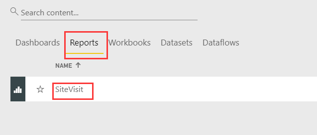

4.	In the reporting page, click on **Pin visual** in the **Scheduled Visits Per Month Chart**.

    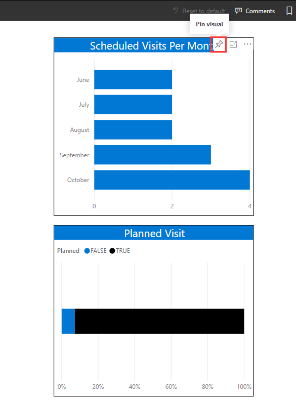

5.	Select the **New dashboard** radio button and enter **SiteVisit** in the textbox, then click **Pin**.

    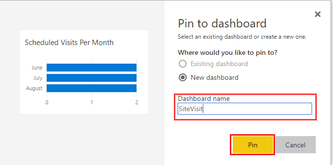

6.  Pin **Planned Visit** to the existing dashboard **SiteVisit**.
    
	

    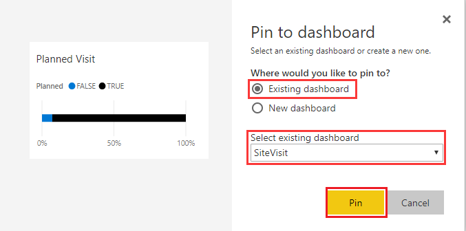

7. Click **Site Visit Tracker** in the menu on the left to go back to the dashboard.

    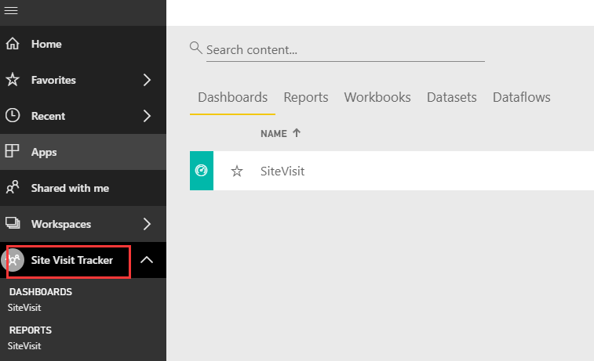

8. Click the name **SiteVisit** to go into the dashboard.

    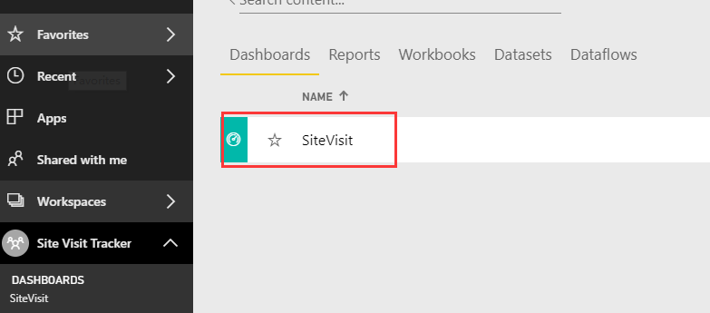

9. Click **...** at the end of the title of the report **Scheduled Visit Per Month**, then click **Edit details**. 

    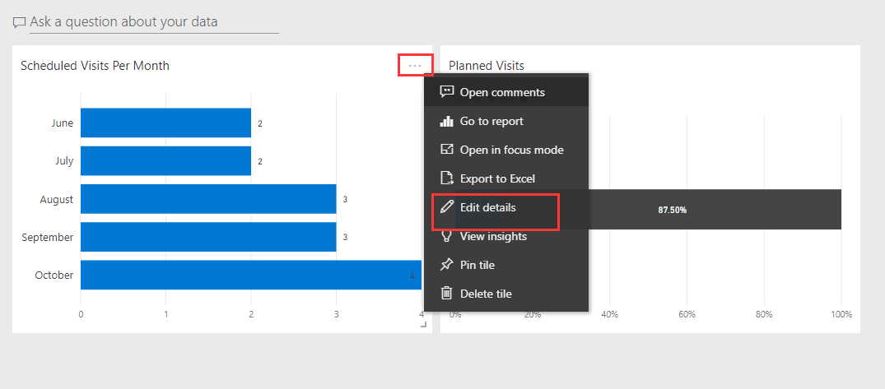

10. Input **Scheduled Visits Per Month** for the title of the tile, then click **Apply**.

    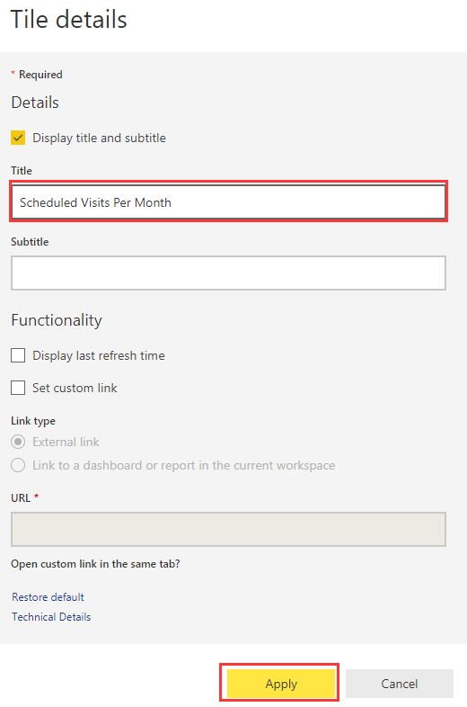

11. Click **...** at the end of the title of the report **Planned Visit**, then click **Edit details**.

    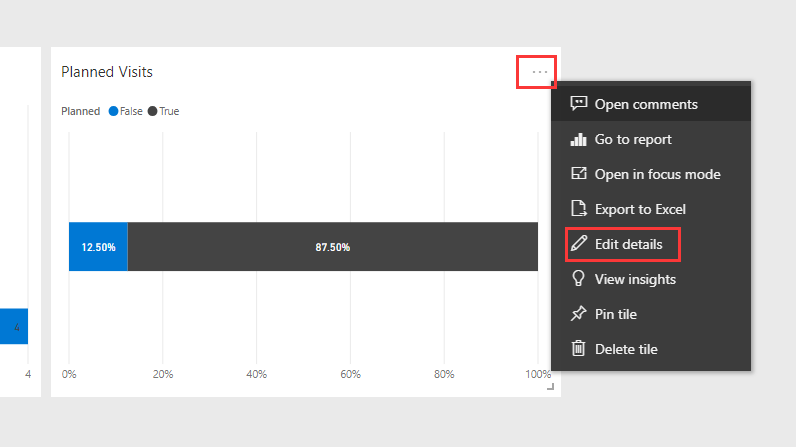

12. Input **Planned Visits** for the title of the tile, then click **Apply**.
    
	

### Schedule the reports
1.  Under the workspace **Site Visit Tracker**, in the **DATASETS** section, and click the **ellipsis** next to **SiteVisit**. Then, select **SCHEDULE REFRESH**.
    
    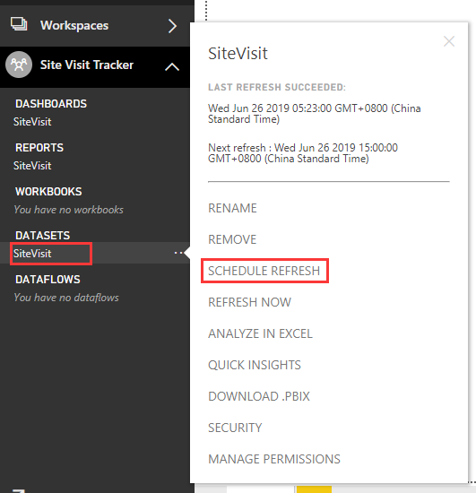

2. Expand the Data source credentials section, then click the **Edit credentials** link.
3. In the **Authentication method** dropdown list select **OAuth2**.
4. In the **Privacy level setting for this data source** dropdown list, select **Organizational**.
5. Click **Sign In**.
6. Select an account that has access to the SharePoint site.
7. Enter the account password if prompted to do so.
8. Expand the **Scheduled refresh** section.
9.  In the Settings panel, turn on the **Keep your data up to date** toggle.  
10. In the **Refresh frequency** dropdown list, select **Daily**.
11. In the **Time zone** dropdown list, select your TimeZone.
12. Click **Apply**
  
    

### Embed the report in SharePoint Online

1. In the left navigation pane, click or tap the report name.

    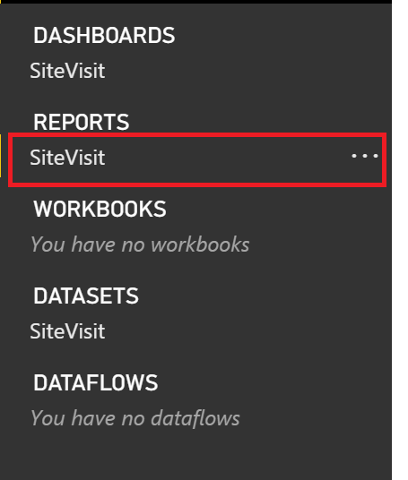

2. Click or tap **File**, then **Embed in SharePoint Online**.

    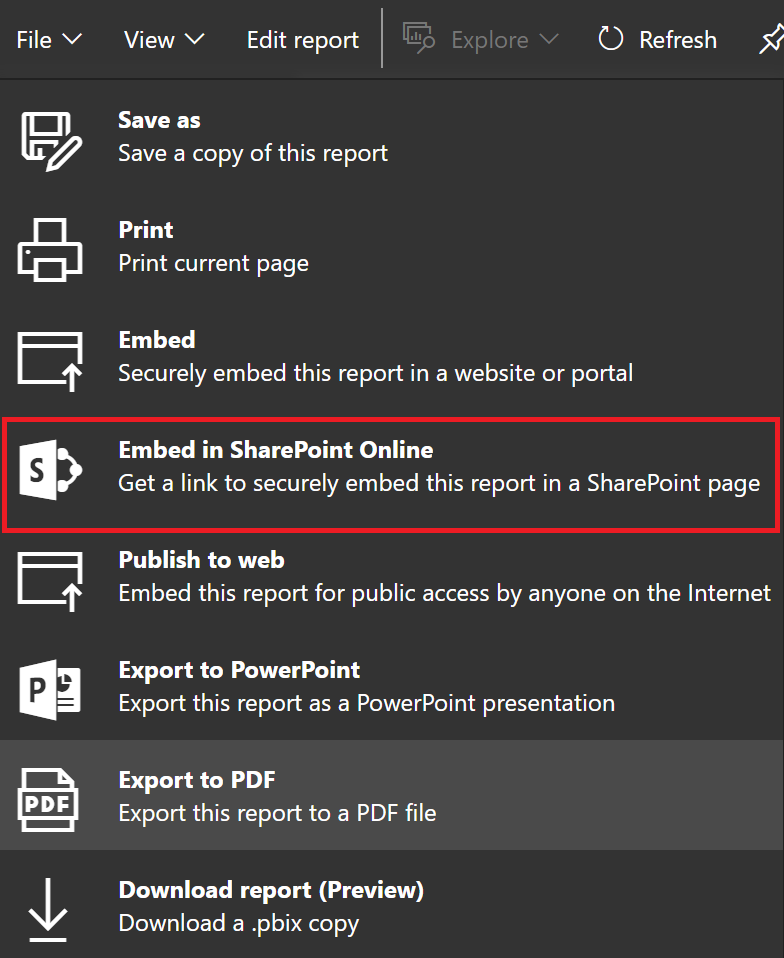

3. Copy the embed link from the dialog box to a file, then click or tap **Close**. We will use the link after we create a SharePoint page.

    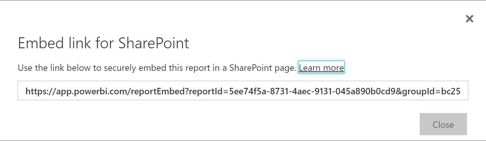

4. Sign in to SharePoint site that was created in previous steps.

5. Click the **Edit** button on the home page to put the page into Edit mode. 

6. Scroll down and locate the Power BI web part. Click **Add report**

    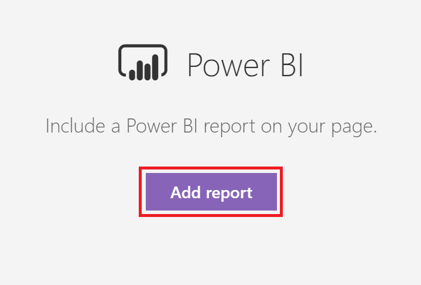

    > In some cases, the PowerBI Report control on the page is not immediately visible. Try to wait a little longer or try to change the size of the window.

7. In the right pane, paste the embed URL into the **Power BI report link** input box.

    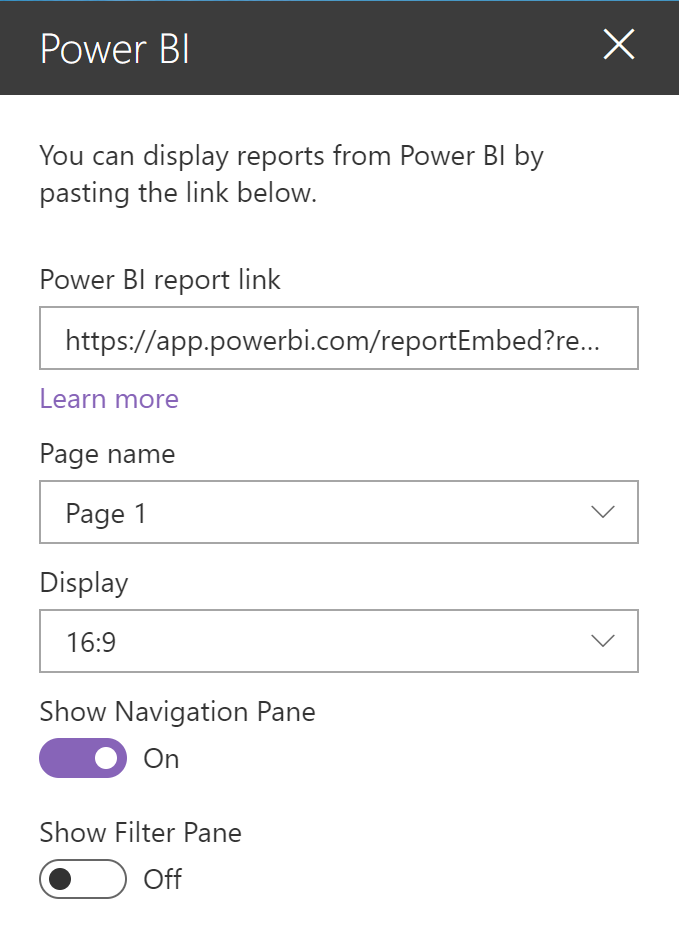

8. Close the right pane and click **Publish or Republish** to make the changes available to everyone.

You should see the report rendering inthe SharePoint page now.

---
## Install the Site Visit Tracker PowerApp
Import the **Site Visit Tracker** PowerApps app.

### Import the PowerApp
1. In a web browser, navigate to [PowerApps](https://make.powerapps.com).

2. Sign in by providing the same credentials that you used to sign in before.

3. In the menu on the left, click **Apps** and then click **Import package (preview)**. 

   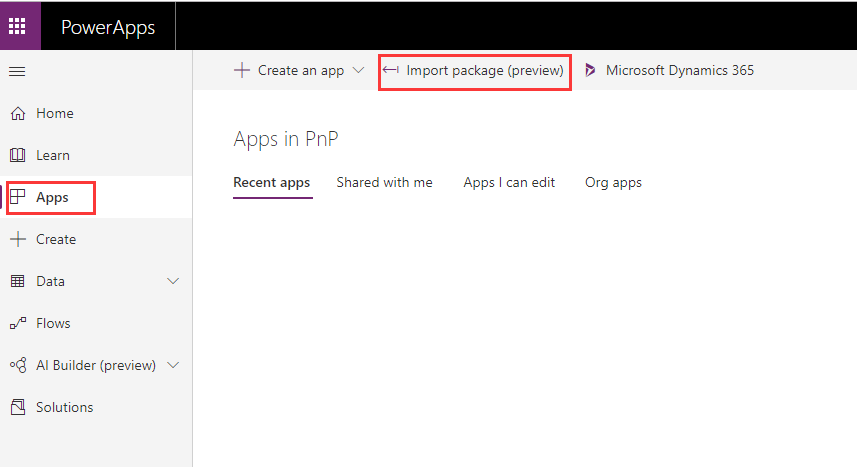

4. Find the file **SiteVisitTrackerApp.zip** on your computer and select it, then click **Upload**. 

5. Click the **Select during import** link for the SharePoint Connection.

   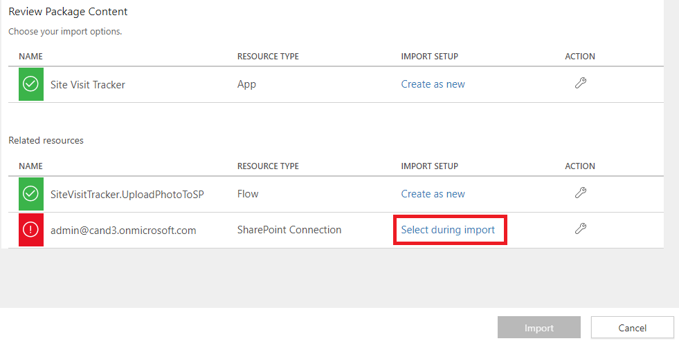

6. In the right panel, select an existing SharePoint connection. If there is no connection existing, please refer to the previous process **Import the Reminder Flow Template -> steps[3-11]** to create the connection.

   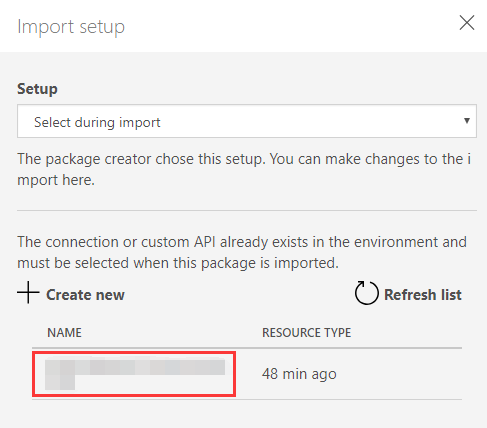

7. When all of these steps are completed, the page should look like the image below. Click **Import**.

   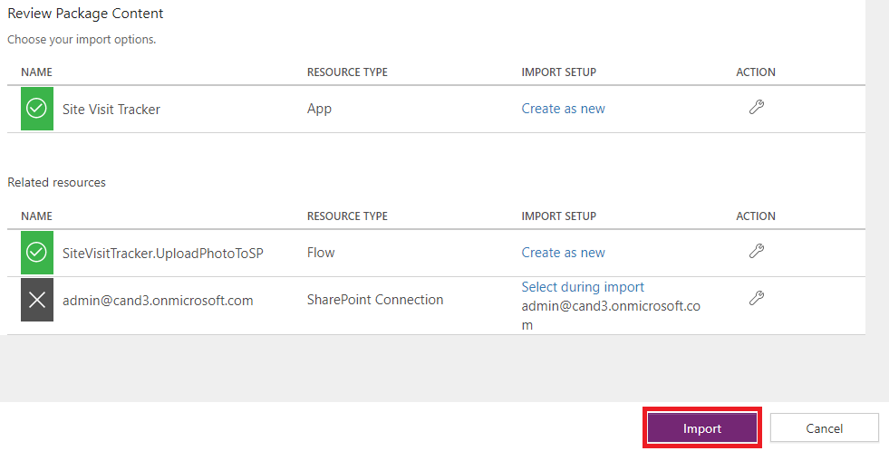

8. After the package is successfully imported, it will look like this.

   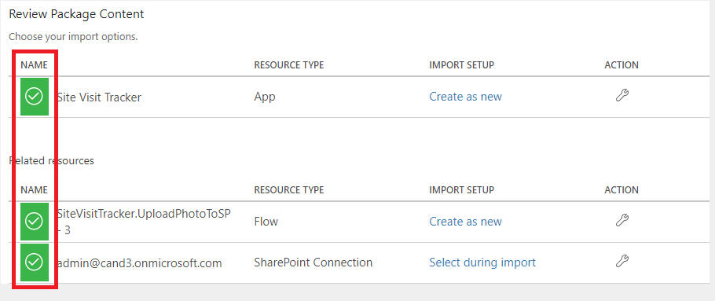

### Modify the Upload Photo Flow

In this section, you will Modify the Flow that uploads images to SharePoint.  The Flow is named **SiteVisitTracker.UploadPhotoToSP**.

1.	In a web browser, navigate to https://flow.microsoft.com.
2.  Click **My flows** in the menu on the left.
3.	In the menu on the left, click **My Flows**.
4.	Next to the **SiteVisitTracker.UploadPhotoToSP**, click the **pencil icon**. 
5.	Expand the **Create file** action. 
6.	Change the **Site Address** to the site where all lists are installed.

    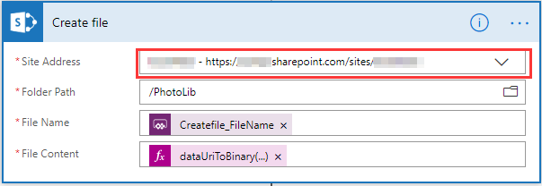

7.	Click **Save**.

### Configure the PowerApp
1. In a web browser, navigate to https://make.powerapps.com.
2. Click **Apps**.
3. Click the **ellipses** next to the Site Visit Tracker PowerApp.
4. Click **Edit**.
5. Click **Allow**.

#### Configure the Photo Library Path
1. Find the control **TextInputPhotosLibraryPath** under the screen **SettingsScreen**.

   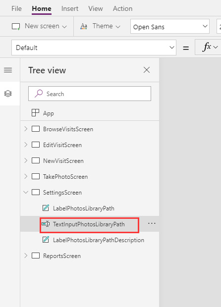

2. Replace this value with the URL to the **PhotoLib** list.

    Example: "https://contoso.sharepoint.com/sites/sitevisittracker/PhotoLib/"

   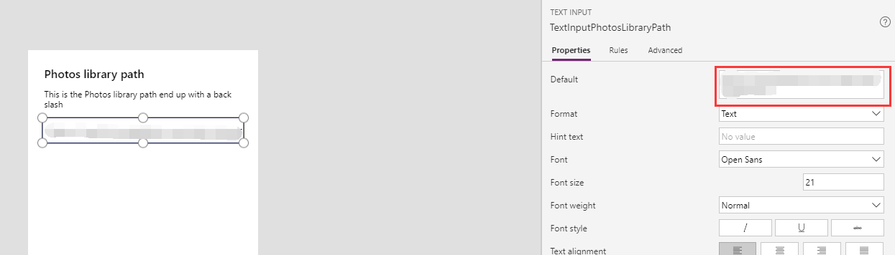

#### Delete the existing connection to the VisitLog and VisitPhotos list
1. Click **View**.

2. Click **Data sources**.

3. In the **Data** pane, click the **ellipsis** next to **VisitLog**.

4. Click **Remove**.

   

5. Use the same process to remove the connection to **VisitPhotos**

#### Connect to the VisitLog and VisitPhotos lists
1. Click **View**.

2. Click **Data sources**.

3. In the **Data** pane, click **Add data source**.

4. Select **SharePoint**.

5. In the **Recent sites** list, select the SharePoint site where you created the VisitLog List.

	>**Note:** If the site does not appear in the list, enter the URL to the SharePoint site in the textbox, then click **Connect**.

6. In the **Search** textbox at the top of the list enter **VisitLog**.

7. Check the checkbox next to the **VisitLog** list.

8. Click **Connect**.

    

9. Use the same process to create a data source named **VisitPhotos**.

    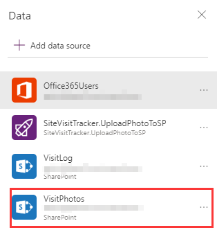

10. Click **File**.

11. Click **Save**.

#### Configure the Power BI report
1. In the left **Tree view** pane, select the **ReportsScreen**.

    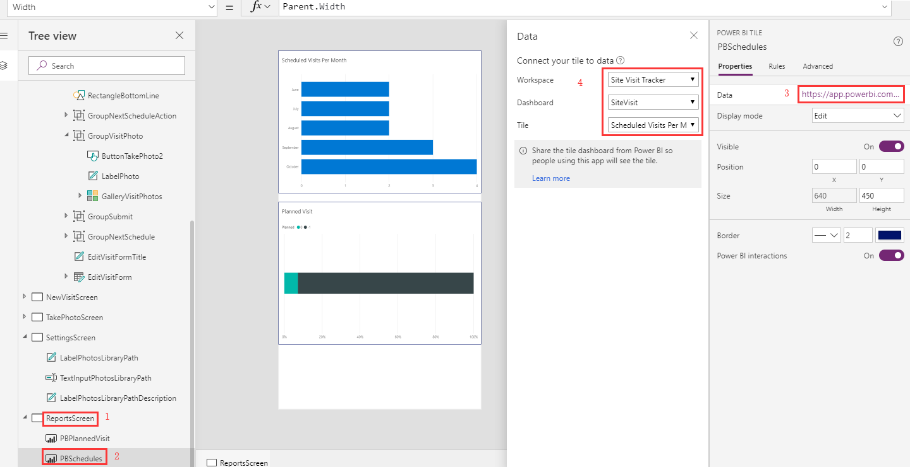

2.  Select the existing **PBSchedules** control.

3.  In the **Properties pane**, click the URL that appears next to the **Data label**.

4.  In the **Workspace** dropdown, select **Site Visit Tracker**.

5.  In the **Dashboard** dropdown, select **SiteVisit**.

6.  In the **Tile** dropdown, select **Scheduled Visits Per Month**.

    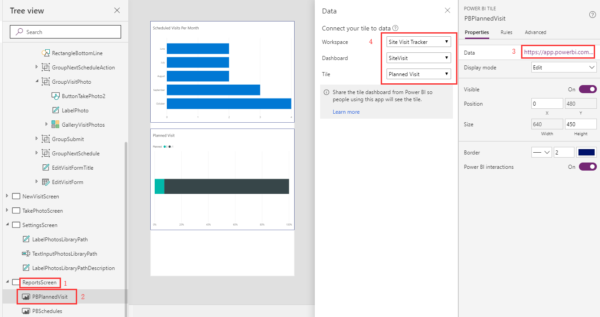

7.  Select the existing **PBPlannedVisit** control.

8.  In the **Properties pane**, click the URL that appears next to the **Data label**.

9.  In the **Workspace** dropdown, select **Site Visit Tracker**.

10.  In the **Dashboard** dropdown, select **SiteVisit**.

11.  In the **Tile** dropdown, select **Planned Visits**.

#### Save and publish the PowerApp
1.  Click **File**.

2.  Click **Save**.

3.  Click **Publish**.

4.  Click **Publish this version**.

5.  After publishing the PowerApp sucessfully, open the PowerApp and you will see the screen below.

    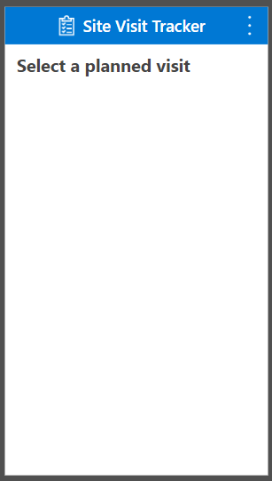