# Install and configure the Travel Approval PowerApps sample

Step-by-step instructions for installing and configuring the Travel Approval PowerApps sample.

Estimated time to complete these steps: **25-30 minutes**

If you would like to see a demonstration of this process, please watch this video.

[](https://localhost )

## Travel Approval PowerApps sample overview
The Travel Request PowerApp allows company employees to easily submit travel requests from desktop or mobile devices. Travel Requests are automatically routed to the appropriate Manager and Travel Department for approval. This reduces processing time. Managers can also access status reports for all travel requests to verify current status and manage the travel budget.


Watch this video to see how to use the Travel Approval PowerApp Sample.

[](https://localhost)

## Prerequisites

- [Sign up](https://web.powerapps.com/) for PowerApps.
- A SharePoint Online global administrator account.
- Have a Power BI account and Power BI Desktop installed.
- Clone the project to your local machine.

## Create the Travel SharePoint list

This list stores all the travel requests.

## Install

1. [Download](https://www.microsoft.com/en-us/download/details.aspx?id=35588) and install the SharePoint Online Management Shell. 

2. Open the SharePoint Online Management Shell command prompt.  To do so, click the **Start** button in Windows, type **SharePoint**, then click **SharePoint Online Management Shell**.

    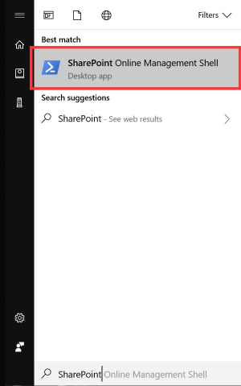

3. In the SharePoint Online Management Shell command prompt, change to the TravelRequest folder under the project that is cloned in your local environment.

    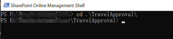

4. Modify the script commands below by replacing the $orgName variable value (replacing all the text between the quotes, including the < and > characters) in the first line of script code, and then run the following commands in the SharePoint Online Management Shell command prompt:

    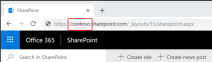

	```powershell
	$orgName="<name of your Office 365 organization, example: contoso>"
	Connect-SPOService -Url https://$orgName-admin.sharepoint.com
	```

	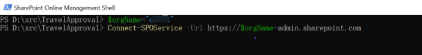

5. When prompted by the Microsoft SharePoint Online Management Shell dialog box, enter the account name and password for a SharePoint global administrator account, and then click Sign in.

    

6. Run following PowerShell script to install the SharePoint Site Script. After running the cmdlet, you get a result that lists the ID of the new Site Script. Copy this ID and save it to a text file, you will need it in subsequent steps.

    ```powershell
    Get-Content '.\travelApprovalList.json' `
        -Raw | `
        Add-SPOSiteScript `
        -Title "TravelApprovalList" 
    ```
    

7.  Run the following cmdlet to add a new Site Design. Replace the **ID** placeholder (replace the ID text, including the < and > characters) with the Site Script ID you saved in the text file.

    ```powershell
    Add-SPOSiteDesign `
        -Title "Travel Approval" `
        -WebTemplate "64" `
        -SiteScripts "<ID>" `
        -Description "Create a site with a list named travel"
    ```

    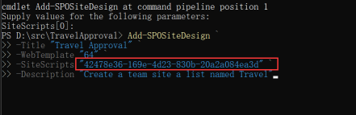

8. Open the SharePoint home page, click **Create site**, then select **Team site**.

    

    

9. Select the **Travel Approval** template and use the screenshot below for reference to enter values for site name, site description and additional owners. Click **Next**.

    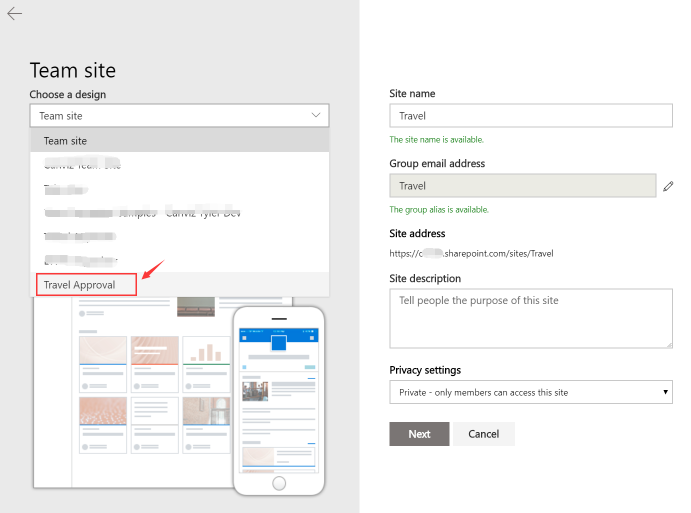

10. Add any additional owners or members, then click **Finish** button to submit.

    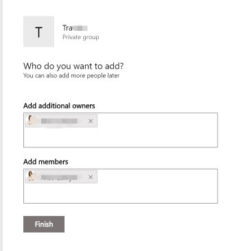

11. When the site is created, the web browser will open the new site and display the status in the right panel.

    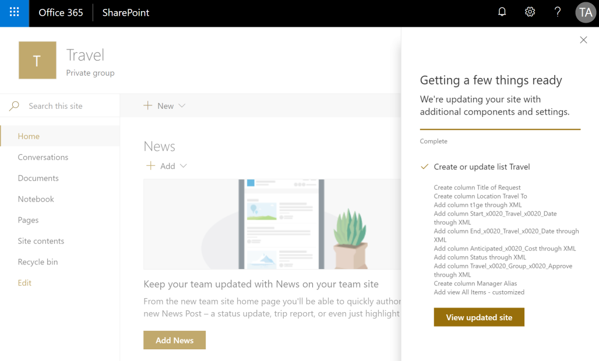

12. Close the status panel on the right, then click the **Site contents** link in the left menu. Verify the **Travel** list exists.

    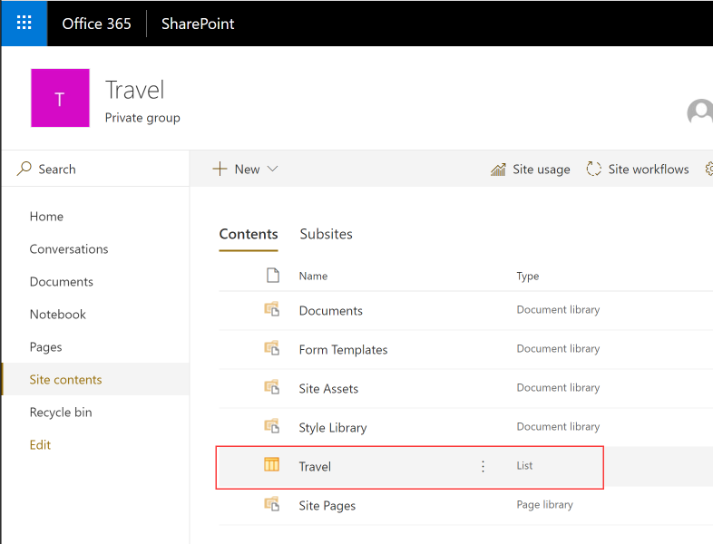

13. **IMPORTANT** Open the **Travel** list and add at least one record for testing. 

    > **Note:** If the SharePoint list is empty, Power BI can not publish the report successfully in the next step.

## Create a Power BI workspace
1. Open a web browser and go to https://app.powerbi.com.
2. Sign in with an account that has a Power BI Pro license.
3. Click **Workspaces**.

    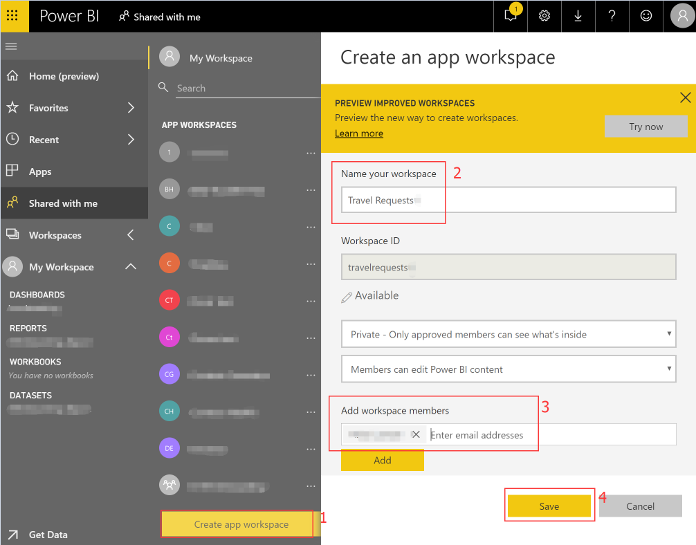

4. Click **Create app workspace**.
5. In the **Name your workspace** textbox, enter Travel Requests.
6. In the **Add workspace members** textbox enter the email addresses for all the users who will need to access the report.
7. Click **Save**.

## Create a Power BI dashboard
1.	Open TravelRequest-Reports.pbix report in the [resource](./resource) folder.
2.	Click **Edit Queries**.

    

3.	Click **Data source settings**.
4.  Click **Change Source..** to update to the data source to use the SharePoint site you created in previous steps. Click **Close**.

    >**Note:** Do not include the full path to the SharePoint list. 

    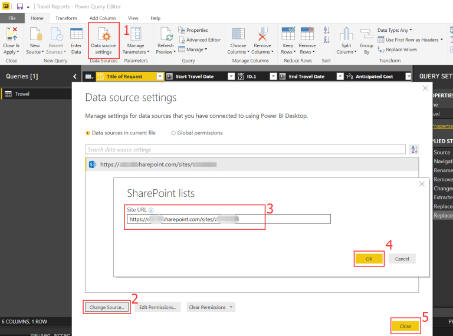

5.  Click **Refresh Preview** to refresh your changes. You may need to **Edit Credentials**  as shown in the screenshot below. Sign in with your **Microsoft account** and select the SharePoint list for Travel Approvals then click **Connect**.

    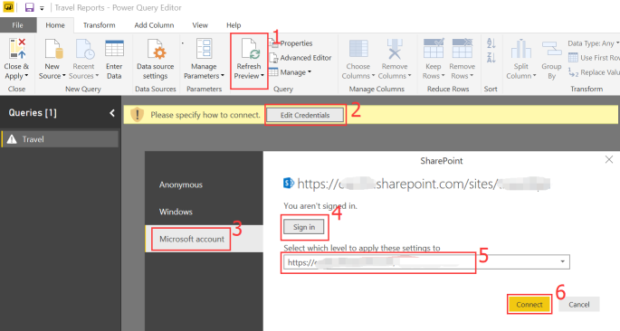

6.  Click **Close & Apply** to apply your changes. Then click the **Publish** button in the Ribbon and select the  workspace you previously created.

    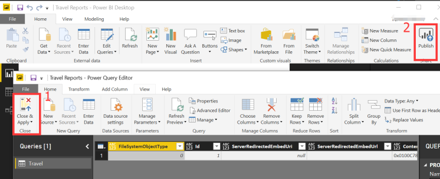

8.	Open the workspace by going to https://app.powerbi.com
9.	Open the existing report and click on **Pin Live Page**.

    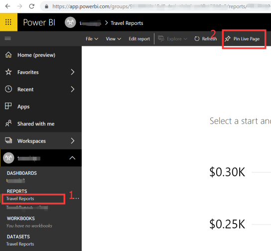

10.	Select the **New dashboard** radio button and enter Travel Report in the textbox, then click **Pin live**.

    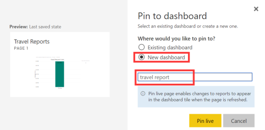

11. Click the **ellipses** next to **Travel Reports** in **DATASETS**, then click **SCHEDULE REFRESH**.

    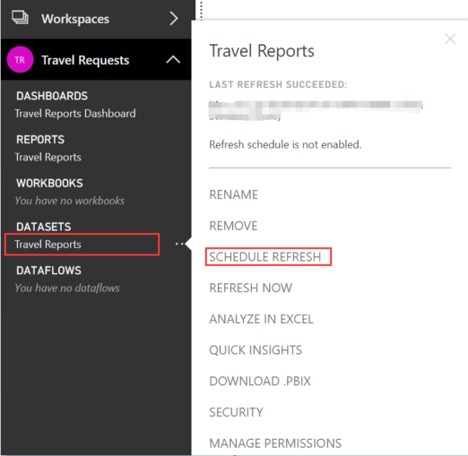

12. Click **Edit credentials**, then select Oauth2.

   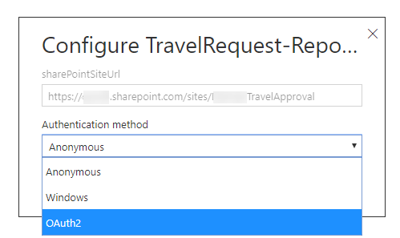

13. In the **Scheduled refresh** section, turn on the **Keep your data update to date** toggle, then click **Apply**.

   

14. Click the **ellipses** next to **Travel Reports** in **DATASETS**, then click **REFRESH NOW**.

    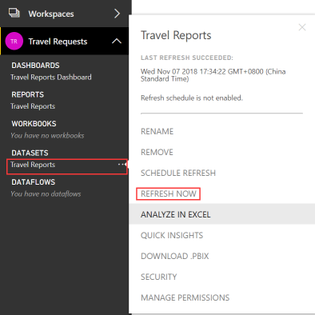

## Create the 'Travel Group Approver' Office 365 Group

1. Open a new PowerShell console as an administrator and run the following command: 

    ```powershell
        Set-ExecutionPolicy RemoteSigned
    ```
2. Then run the create-group.ps1 script to create the 'Travel Group Approver' Office 365 group.  This script is found in the root directory of the local folder where you cloned the sample. When the cmdlet runs, you will be prompted to login.  Login with an account hat is a SharePoint Online global administrator. Copy and save the  **<ExternalDirectoryObjectId>**, **<PrimarySmtpAddress>** values returned by the script.  

    ```powershell
    ./create-group.ps1
    ```

    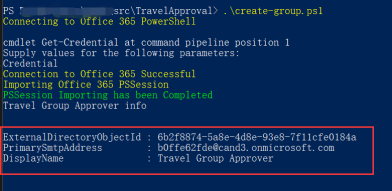

3. Run the following command: 
    
    ```powershell
        Set-ExecutionPolicy Default     
    ```

## Get the Travel Request PowerApp

>**Note:** The steps in this article demonstrate how to install and configure the tablet version of the PowerApp.  The steps are exactly the same for the mobile version, except for the PowerApp zip file you download and import.

1.	Get the mobile version TravelRequestMobile-PowerApp.zip under [TravelApproval/resource](./resource/) folder in your local project that is cloned in your local environment.
2.	Get the tablet version TravelRequestPad-PowerApp.zip under [TravelApproval/resource](./resource/) folder in your local project that is cloned in your local environment.

## Import the Travel Request PowerApp
1.	In a web browser, navigate to https://web.powerapps.com.
2.	Sign in by providing the same credentials that you used to sign up.
3.	In the menu on the left, select **Apps**. 
4.	Click **Import package(preview)**.
5.	Click the **Upload** button, then select the PowerApp package you downloaded in previous steps.
	
	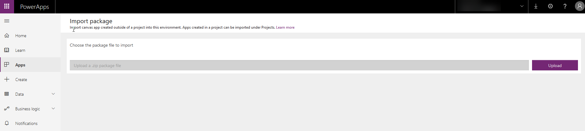

6.	When the import process completes, verify the **IMPORT SETUP** value is set to **Create as new**.

	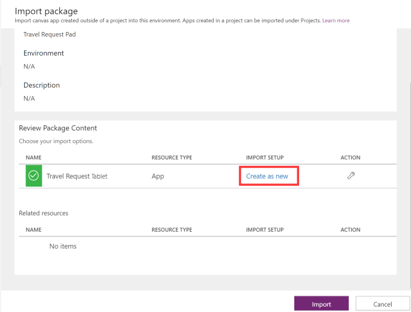

7.	Click **Import** and wait until the process is complete.

	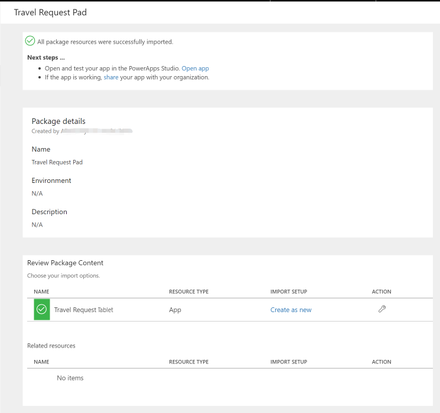

## Configure the PowerApp

1. In the web browser, click **Apps**.
2. Click the **ellipses** next to the Travel Request PowerApp.
3. Click **Edit**.
4. Click **Allow**.

    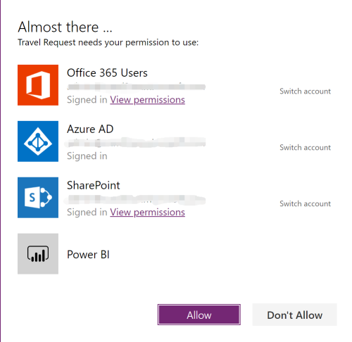

### Delete existing connection to the Travel list

1. Click **View**.
2. Click **Data sources**.
3. In the **Data** pane, click the **ellipses** next to **Travel**.
4. Click **Remove**.

    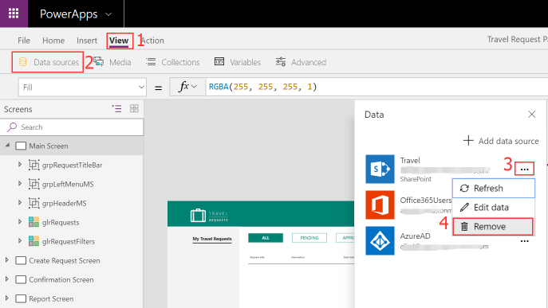

### Connect to Travel request list 

1. Click **View**.
2. Click **Data sources**.
3. In the **Data** pane, click **Add data source**.
4. Select **SharePoint**.
5. In the **Recent sites** list, select the SharePoint site where you created the Travel Request List.

	>**Note:** If the site does not appear in the list, enter the URL to the SharePoint site in the textbox, then click **Go**.

6. In the **Search** textbox at the top of the list enter **Travel**.
7. Check the checkbox next to the **Travel** list.
8. Click **Connect**.

    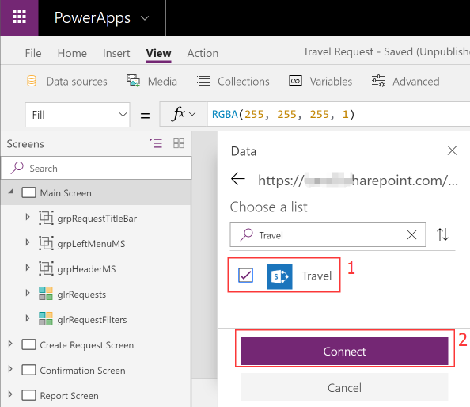

9. Click **File**.
10. Click **Save**.

### Configure the Power BI report

1. In the **Screens** pane, select the **Reports Screen**.

    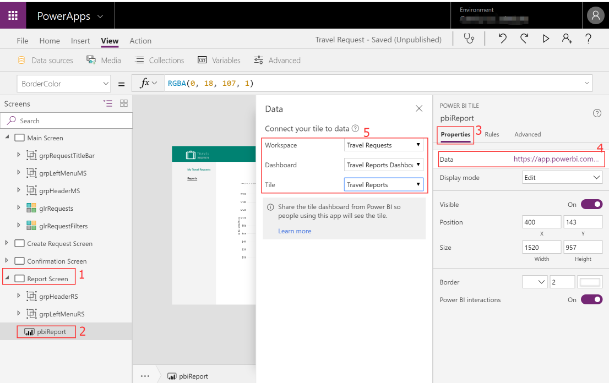

2.  Select the existing **pbiReport** control and edit it's properties.
3.  In the **Properties pane**, click the URL that appears next to the Data label.
4.  In the **Workspace** dropdown, select **Travel Requests**.
5.  In the **Dashboard** dropdown, select **Travel Requests Dashboard**.
6.  In the **Tile** dropdown, select **Travel Reports**.
7.  Click **File**.
8.  Click **Save**.
9.  Click **Publish**.
10. Click **Publish this version**.

### Update travel approval group name
1. Select **Main Screen** on the left menu, click **Action**, then click the **On Start** button.  Then, enlarge the input text box.

    
    
2. Update the **<ExternalDirectoryObjectId>** and **<PrimarySmtpAddress>** placeholders with the values the PowerShell returned in the **Create Travel Group Approver Group** steps.

    > **Note:** Make sure you replace the < and > characters in the placeholders.

    

### Save and Publish the app
1. Click **File** on the main menu and click **Save** to submit the changes.
2. Click **Publish** and **Publish this version**

##Modify the Flow

### Login Microsoft Flow
1.	In a web browser, navigate to https://flow.microsoft.com
2.	Sign in with your work account

### Create connections
1.	In the menu on the left, select **Data** > **Connections**.
2.  Click **+New connection**.
3.	Add **SharePoint** connection with **Connect directly (cloud-services)** settings.

    

4.  Add **Approvals connection**, **Office 365 Outlook** and **Office 365 Group** connections as previously.

### Import Flow Template 
1.  Change to **My flows** menu on the left.
2.  Click **Import**, click **Upload** button then pick TravelRequest-Flow.zip.
3.  Resolve conflicts for related resources by clicking on **Select during import** and select click **Save**

    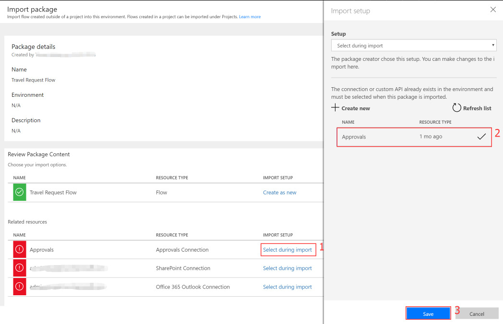

    > **Note:** Import failed may be caused by a flow with the same name already in the system. Remove the existing one and import again.

4.  Click **Import**

    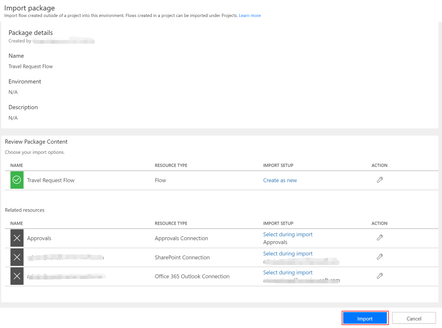

## Modify the Flow
1.	In the menu on the left, click **My Flows**.
2.	If prompted to sign in, sign in by providing the same credentials that you used to sign up.
3.	Next to the **Travel Request Flow**, click the **pencil icon**. 
4.	Expand the **When a new item is created** action. 
5.	Change the **Site Address** and **List Name** to match the Travel SharePoint list you created.
	
	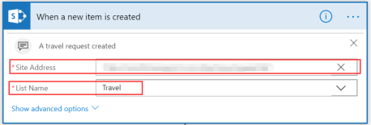
 
	> **Note:** You don’t need to type it manually, you can choose it in the dropdown lists.

6.  Expand the following 6 actions and change the **Site Address** and **List Name** to match the Travel SharePoint list you created.

* **Did manager approve** -> **If yes** -> **Update item**

    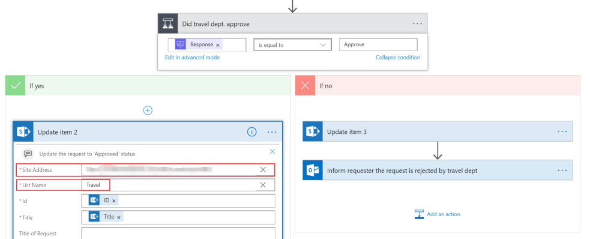

* **Did manager approve** -> **If no** -> **Update item 5**
* **Did manager approve** -> **If yes** -> **Did travel dept. approve** -> **If yes** -> **Update item 2**
* **Did manager approve** -> **If yes** -> **Did travel dept. approve** -> **If no** -> **Update item 3**
* **Get item**
* **Is there no manager response** -> **if yes** -> **Get item 2**

7.	Click **Save**.

    > **Note:** Make sure form creator (Travel Requestor) has manager that is configured in AAD and Travel Department Group has member in it. Then the Flow will work normally.

## Play the PowerApp

1. In the web browser, click **Apps**.
2. Click the **ellipses** next to the Travel Request Mobile PowerApp.
3. Click **Play**. 

    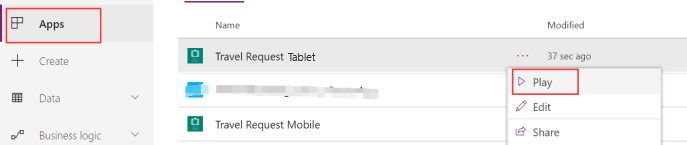

Watch this video to see how to use the Travel Request PowerApp Sample.

[](https://youtu.be/sl5fXwwnvzI)

## Next steps
- [Customize a SharePoint list form](https://docs.microsoft.com/en-us/powerapps/maker/canvas-apps/customize-list-form)
- [Add and configure a control](https://docs.microsoft.com/en-us/powerapps/maker/canvas-apps/add-configure-controls)
- [Edit and manage permissions for a SharePoint list or library](https://support.office.com/en-us/article/edit-and-manage-permissions-for-a-sharepoint-list-or-library-02d770f3-59eb-4910-a608-5f84cc297782)
 
